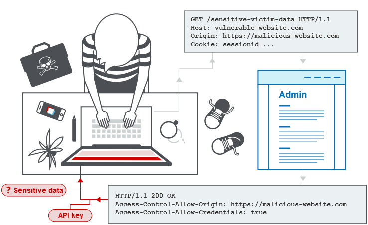

## 1. Định nghĩa

- cơ chế trình duyệt web cho phép truy cập có kiểm soát vào các tài nguyên nằm bên ngoài trang web. Nó mở rộng và bổ sung tính linh hoạt cho chính sách cùng nguồn gốc (SOP).

- tiềm ẩn tấn công giữa các miền nếu chính sách kém.



## 2. SOP (Same-origin Policy)

- đặc tả hạn chế nhiều nguồn nhằm giới hạn khả năng trang web tương tác với các tài nguyên bên ngoài trang web.

- ứng phó với các tương tác giữa các miền độc hại tiềm ẩn, chẳng hạn như một trang web đánh cắp dữ liệu riêng tư từ một trang web khác. Nó thường cho phép một miền đưa ra yêu cầu cho các miền khác nhưng không truy cập được các phản hồi.

## 3. Nới lỏng SOP

- Chính sách cùng nguồn gốc rất hạn chế và do đó nhiều cách tiếp cận khác nhau đã được đưa ra để tránh những hạn chế đó. Nhiều trang web tương tác với tên miền phụ hoặc trang web của bên thứ ba theo cách yêu cầu quyền truy cập đầy đủ từ nhiều nguồn gốc. Có thể nới lỏng có kiểm soát chính sách cùng nguồn gốc bằng cách sử dụng chia sẻ tài nguyên nhiều nguồn gốc (CORS).

- Giao thức chia sẻ tài nguyên nhiều nguồn gốc sử dụng một bộ tiêu đề HTTP xác định nguồn gốc web đáng tin cậy và các thuộc tính liên quan, chẳng hạn như liệu quyền truy cập được xác thực có được phép hay không. Chúng được kết hợp trong trao đổi tiêu đề giữa trình duyệt và trang web có nguồn gốc chéo mà nó đang cố truy cập.

## [4. Lý do phát sinh](./lab/part1.md)

> ***ACAO: Access Control Allow Origin***

### 4.1. Tiêu đề ACAO do máy chủ tạo từ tiêu đề Origin do khách hàng chỉ định

- truy cập được từ bất kỳ nguồn nào: `Origin: nguồn_bất_kỳ`

- Response sẽ trả về:

```
HTTP/1.1 200 OK
Access-Control-Allow-Origin: nguồn_bất_kỳ
Access-Control-Allow-Credentials: true
```

### 4.2. Whitelist null origin value

- Header: `Origin: null`, trong các trường hợp

    - Chuyển hướng nhiều cross-origin

    - Yêu cầu dữ liệu tuần tự

    - Yêu cầu sử dụng `file`: Protocol

    - Yêu cầu Sandboxed cross-origin

- Response sẽ trả về:

```
HTTP/1.1 200 OK
Access-Control-Allow-Origin: null
Access-Control-Allow-Credentials: true
```

### 4.3. Exploiting XSS via CORS trust relationships

### 4.4. Intranets and CORS without credentials (EXPERT)