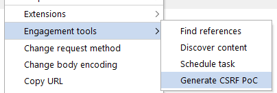

# 1. Định nghĩa

- khiến nạn nhân thực hiện hành động mà không có ý định thực hiện.

- phá vỡ một phần SOP - được thiết kế để ngăn chặn các trang web khác nhau can thiệp lẫn nhau.

# 2. Ảnh hưởng

- khiến nạn nhân vô tình thực hiện 1 hành động, chẳng hạn như thay đổi password, email, ...

- có thể giành được quyền kiểm soát tài khoản của người dùng, đặc biệt là người dùng có đặc quyền, kẻ tấn công có thể toàn quyền kiểm soát hệ thống.

# 3. Hoạt động

- 3 điều kiện để thực hiện tấn công

    - **Hành động có liên quan:** chẳng hạn như hành động thay đổi password. (1)

    - **Xử lý phiên dựa trên cookie:** dựa vào cookie để xác định người dùng thực hiện yêu cầu. → sẽ bị tấn công khi không có mã thông báo hoặc cơ chế theo dõi phiên người dùng. (2)

    - **Không có thông số yêu cầu không thể đoán trước:** chẳng hạn khi thực hiện thay đổi password, thì sẽ bị tấn công khi không yêu cầu nhập password hiện tại (password hiện tại chính là thông số yêu cầu không thể đoán trước). (3)

# 4. XSS vs CSRF

| XSS | CSRF |
|-----|------|
| thực hiện JS trong trình duyệt của nạn nhân| xúi giục nạn nhân thực hiện hành động họ không có ý định thực hiện |
|nghiêm trọng hơn, khiến người dùng thực hiện bất kỳ hành động nào mà họ có thể thực hiện| áp dụng cho 1 số hành động người dùng có thể thực hiện|
|lỗ hổng "một chiều", khiến nạn nhân đưa ra yêu cầu HTTP nhưng học không thể truy xuất phản hồi từ yêu cầu đó| lỗ hổng "hai chiều" tập lệnh được chèn có thể đưa ra các yêu cầu tùy ý, đọc phản hồi và trích xuất dữ liệu sang miền bên ngoài mà kẻ tấn công lựa chọn.|

> Can CSRF tokens prevent XSS attacks??????

# [5. Xây dựng CSRF Attack](./lab/part1.md#lab-1-csrf-vulnerability-with-no-defenses)

Sử dụng `CSRF PoC generator` in `Burp Suite Pro`

Nếu không sử dụng `Burp Suite Pro` thì tự viết form tự động submit.

Khai thác

# [6. Bypass xác thực CSRF token](./lab/part1.md)

- CSRF token là một giá trị duy nhất, bí mật và không thể đoán trước được tạo bởi ứng dụng phía máy chủ và được chia sẻ với khách hàng. Khi đưa ra yêu cầu thực hiện hành động nhạy cảm, chẳng hạn như gửi biểu mẫu, khách hàng phải bao gồm mã thông báo CSRF chính xác. Nếu không, máy chủ sẽ từ chối thực hiện hành động được yêu cầu.

- Xác thực tùy thuộc vào method request (lab 2)

    - method `POST` → method `GET`

- Xác thực phụ thuộc vào token hiện có (lab 3)

    - có CSRF token nhưng không có cũng vẫn ok

- CSRF token không bị ràng buộc với phiên người dùng (lab 4)

    - không xác thực token cùng phiên với người dùng đang thực hiện yêu cầu.

    → kẻ tấn công có thể lấy token của mình cho nạn nhân

- CSRF token gắn với cookie không có phiên (lab 5)

- CSRF token được sao chép đơn giản trong cookie (lab 6)

# [7. Bypassing hạn chế cookie SameSite](./lab/part2.md)

Tất cả các trình duyệt chính hiện đều hỗ trợ các mức hạn chế SameSite sau:

- `Strict`: trình duyệt sẽ không gửi cookie đó trong bất kỳ yêu cầu giữa các trang web nào.

- `Lax`: trình duyệt sẽ gửi cookie theo yêu cầu trên nhiều trang web, nhưng chỉ khi đáp ứng cả hai điều kiện sau:

    - Yêu cầu sử dụng phương thức GET.

    - Yêu cầu này xuất phát từ việc điều hướng cấp cao nhất của người dùng, chẳng hạn như nhấp vào liên kết. 

- `None`

