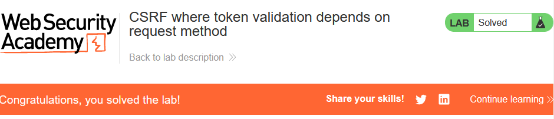
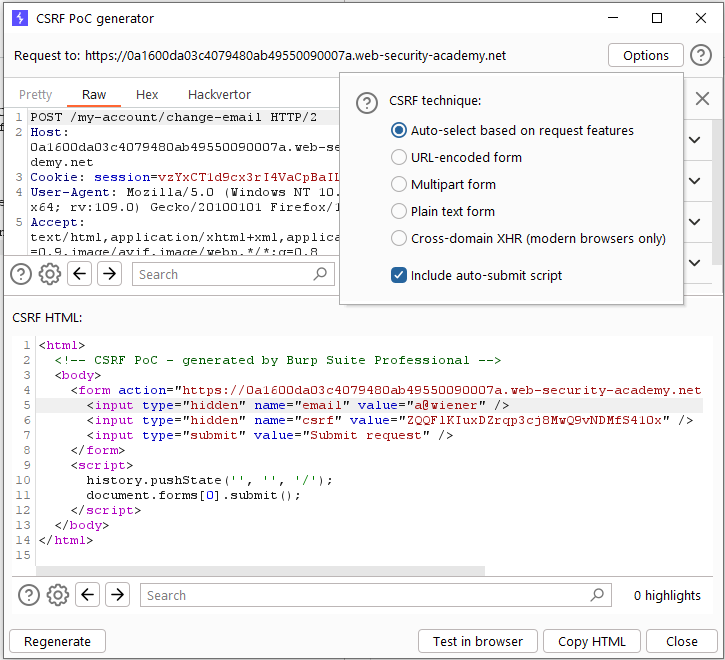
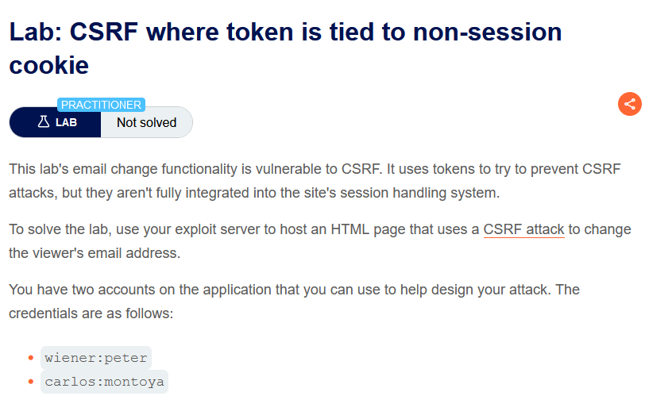
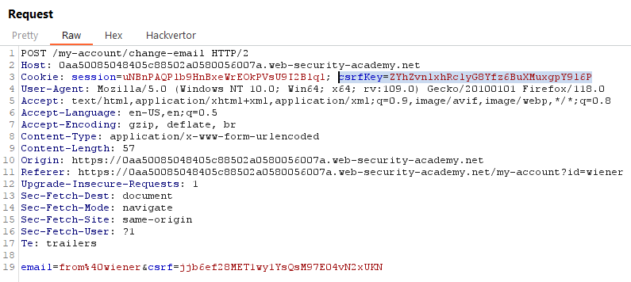
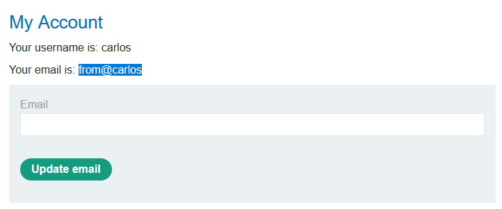
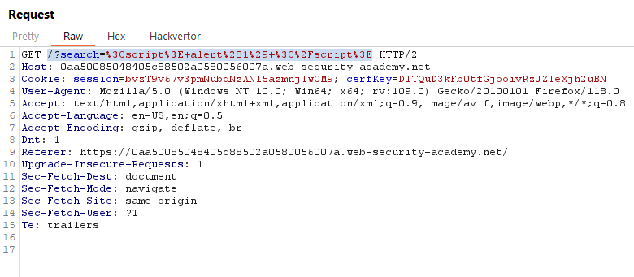

# [Lab 1: CSRF vulnerability with no defenses](https://portswigger.net/web-security/csrf/lab-no-defenses)

> - **Mô tả lab:** Lỗi `CSRF` ở chức năng thay đổi email.
>
> - **Mục tiêu:** tạo `HTML` thực hiện tấn công `CSRF` để thay đổi email của người dùng và tải lên exploit server.

Đăng nhập `wiener:peter`, ta thấy có chức năng `Update email`  (1, 3)

Quan sát Request, ta thấy không hề có `csrf token` để xác nhận với mỗi lần thay đổi email (2)

→ Đủ điều kiện để thực hiện tấn công CSRF, do không thể để email trùng với tài khoản khác → dùng email khác `b@test`

`Delivery to victim`

Solve lab

# [Lab 2: CSRF where token validation depends on request method](https://portswigger.net/web-security/csrf/bypassing-token-validation/lab-token-validation-depends-on-request-method)

> - **Mô tả lab:** Vẫn lỗi như **lab 1**, tuy nhiên có cố gắng chặn các cuộc tấn công CSRF nhưng chỉ áp dụng biện pháp phòng vệ cho một số loại request.
>
> - **Mục tiêu:** cũng như **lab 1**.

Đăng nhập với `wiener:peter`, ta thấy có chức năng `Update email` (1, 3)

Quan sát Request gửi đi thì ta thấy đã có `CSRF token` xác nhận

Ta sẽ kiểm tra xem có thực sự cần đến `CSRF token`. Vì sử dụng `POST` nhưng bỏ tham số `csrf` đi thì không thành công do thiếu tham số nên ta sẽ thực hiện bằng cách đổi `method` thành `GET`

Và kết quả vẫn `Update email` thành công (2)

→ Tấn công CSRF thôi

`Delivery to victim`

Solve lab

# [Lab 3: CSRF where token validation depends on token being present](https://portswigger.net/web-security/csrf/bypassing-token-validation/lab-token-validation-depends-on-token-being-present)

> - **Mô tả lab:** cũng lỗi như 2 lab trên.
>
> - **Mục tiêu:** và mục tiêu cũng vẫn vậy.

Đăng nhập với `wiener:peter`, ta thấy có chức năng `Update email` (1, 3)

Request có chứa `CSRF Token`

Tuy nhiên bỏ đi thì vẫn hoàn toàn `Update email` thành công (2)

→ Tấn công CSRF thôi

Gửi cho nạn nhân

SOLVE

# [Lab 4: CSRF where token is not tied to user session](https://portswigger.net/web-security/csrf/bypassing-token-validation/lab-token-not-tied-to-user-session)

> - **Mô tả lab:** Lỗi `CSRF` ở chức năng thay đổi email, sử dụng token để ngăn chặn tấn công này nhưng được tích hợp xử lý cùng session.
>
> - **Mục tiêu:** Vẫn như các lab trên thôi.

Đăng nhập với `wiener:peter`, ta thấy có chức năng `Update email` (1, 3)

Request có chứa `CSRF token` bảo vệ

Đăng nhập với `carlos:montoya`

Do token không được xử lý cùng với session nên ta sẽ tiến hành đổi CSRF token của `wiener` và `carlos` với nhau xem session của wiener có thay đổi email được của carlos không

thành công

thử ngược lại lấy CSRF của carlos cho wiener xem có đổi được không và đương nhiên là vẫn thành công

→ Tấn công CSRF

vì mỗi khi F5 sẽ thay đổi CSRF token nên trước khi delivery cho victim ta đổi CSRF token đã

delivery solve lab

# [Lab 5: CSRF where token is tied to non-session cookie](https://portswigger.net/web-security/csrf/bypassing-token-validation/lab-token-tied-to-non-session-cookie)

> - **Mô tả lab:**
>
> - **Mục tiêu:**

main web

login `wiener:peter`

có cả CSRF token và key

đổi cả 2 cái ở 2 account cho nhau xem

vẫn thay được bình thường

→ Tấn công CSRF

`Search` không có CSRF bảo vệ → chèn cookies vì `csrfKey` ở Cookie

`/?search=test%0d%0aSet-Cookie:%20csrfKey=YOUR-KEY%3b%20SameSite=None`

→ đổi script thành thẻ img dẫn đến src là endpoint trên thì tự động thực hiện submit

`

`

View exploit để xem có thay đổi thành công không

solve lab thôi

# [Lab 6: CSRF where token is duplicated in cookie](https://portswigger.net/web-security/csrf/bypassing-token-validation/lab-token-duplicated-in-cookie)

> - **Mô tả lab:**
>
> - **Mục tiêu:**

login `wiener:peter`, `Update email`

Request, cả Session và body đều có csrf token giống nhau

thay cả 2 thì mới thay đổi thành công

Search

→ thay đổi script auto submit

