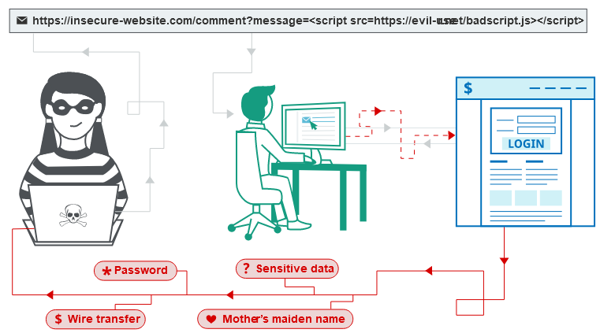

# 1. Định nghĩa

- ***Cross-site scripting (XSS)*** là một lỗ hổng bảo mật trên web cho phép kẻ tấn công xâm nhập vào tương tác giữa người dùng và ứng dụng có lỗ hổng.

- Kẻ tấn công có thể giả mạo người dùng bị tấn công, thực hiện các hành động và truy cập vào dữ liệu của người dùng. Nếu người dùng bị tấn công có quyền truy cập đặc biệt, kẻ tấn công có thể kiểm soát toàn bộ chức năng và dữ liệu của ứng dụng.

# 2. Cách hoạt động

- Thao túng một trang web dễ bị tấn công để nó trả về JavaScript độc hại cho người dùng. Khi mã độc thực thi bên trong trình duyệt của nạn nhân, kẻ tấn công hoàn toàn có thể xâm phạm sự tương tác của họ với ứng dụng.

- xác nhận lỗ hổng XSS bằng cách chèn 1 payload thực thi một số JavaScript tùy ý, thông thường là sử dụng hàm `alert()` vì ngắn gọn lại không gây hại, ngoài ra còn có `print()`.

# [3. Các loại tấn công XSS](./lab/part1.md)

## 3.1. Reflected XSS (lab 1)

- Phát sinh khi ứng dụng nhận được dữ liệu trong yêu cầu HTTP và bao gồm dữ liệu đó trong phản hồi ngay lập tức theo cách không an toàn.

- Ảnh hưởng:

    - Thực hiện bất kỳ hành động nào trong ứng dụng mà người dùng có thể thực hiện.

    - Xem bất kỳ thông tin nào mà người dùng có thể xem.
    - Sửa đổi bất kỳ thông tin nào mà người dùng có thể sửa đổi.
    - Khởi tạo tương tác với người dùng khác trong ứng dụng, bao gồm các cuộc tấn công độc hại, mà sẽ có vẻ như bắt nguồn từ người dùng ban đầu bị tấn công.

- Để tìm và kiểm thử lỗ hổng này, có thể thực hiện các bước sau:

    **1. Xác định các điểm nhập dữ liệu trong ứng dụng**, chẳng hạn như tham số URL hoặc dữ liệu trong phần body.

    **2. Chèn giá trị thử nghiệm** vào các điểm nhập dữ liệu và kiểm tra xem liệu giá trị này có được phản chiếu trong phản hồi hay không. 

    **3. Xác định ngữ cảnh phản chiếu** để hiểu cách dữ liệu được phản chiếu trong phản hồi, ví dụ như xem liệu nó được chèn vào văn bản, thuộc tính HTML hay mã JavaScript. 

    **4. Kiểm tra sự khả thi** của cuộc tấn công bằng cách thử nghiệm các tải trọng XSS khác nhau dựa trên ngữ cảnh phản chiếu.

    **5. Kiểm tra cuộc tấn công trên trình duyệt** thực tế để xác nhận rằng mã JavaScript được thực thi.

## 3.2. Stored XSS (lab 2)

- Phát sinh khi ứng dụng nhận dữ liệu từ một nguồn không đáng tin cậy và đưa dữ liệu đó vào các phản hồi HTTP sau này theo cách không an toàn.

- Ảnh hưởng:

    - Tấn công Stored XSS có thể gây ảnh hưởng tương tự như tấn công reflected XSS.

    - Kẻ tấn công đơn giản chỉ cần đặt mã độc vào ứng dụng và chờ đợi người dùng gặp nó.

    - Lỗ hổng `Stored XSS` đặc biệt quan trọng khi chỉ ảnh hưởng đến người dùng đã đăng nhập.

- Cách thực hiện kiểm thử này bao gồm các bước sau:

    - ***Xác định các điểm vào (entry points) và điểm ra (exit points)*** của dữ liệu trong ứng dụng. Các điểm vào là những nơi mà dữ liệu từ người dùng được chấp nhận, chẳng hạn như các tham số trong URL hoặc tin nhắn. Các điểm ra là những nơi mà dữ liệu đó xuất hiện trong phản hồi của ứng dụng.

    - ***Gửi các giá trị cụ thể vào các điểm vào*** và theo dõi phản hồi từ ứng dụng. Mục tiêu là phát hiện các trường hợp mà dữ liệu gửi đi xuất hiện trong phản hồi.

    - ***Xác định ngữ cảnh của dữ liệu trong phản hồi***, tức là nơi mà dữ liệu được lưu trữ và xuất hiện. Điều này giúp định rõ vị trí có thể khai thác để tạo ra lỗ hổng XSS.

    - ***Kiểm tra các payload XSS phù hợp*** với ngữ cảnh đã xác định. Mục tiêu là tìm ra các giá trị dữ liệu đặc biệt có thể gây ra lỗ hổng XSS trong ứng dụng.

## 3.3. DOM-based XSS (lab 3 đến lab 10)

- Để thực hiện, đặt data vào source để dữ liệu được truyền đến sink và thực thi JavaScipt tùy ý.

- Source phổ biến nhất là `URL`, thường được truy cập bằng đối tượng `window.location`

- Khai thác

# [4. XSS contexts](./lab/part2.md)

## 4.1. XSS between HTML tags

lab 11 đến lab 14, lab 15 (EXPERT), lab 16

## 4.2. XSS in HTML tag attributes

## 4.3. XSS into JavaScript
