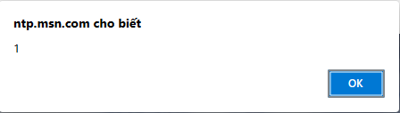
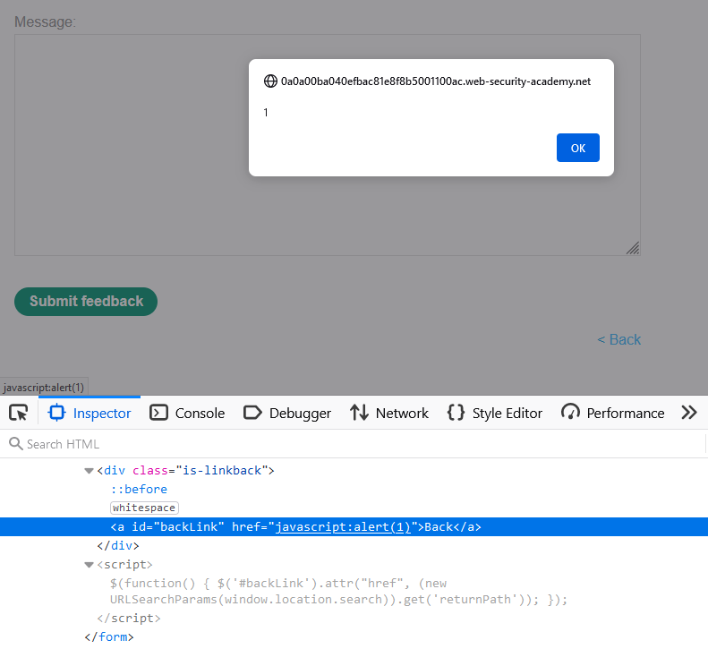
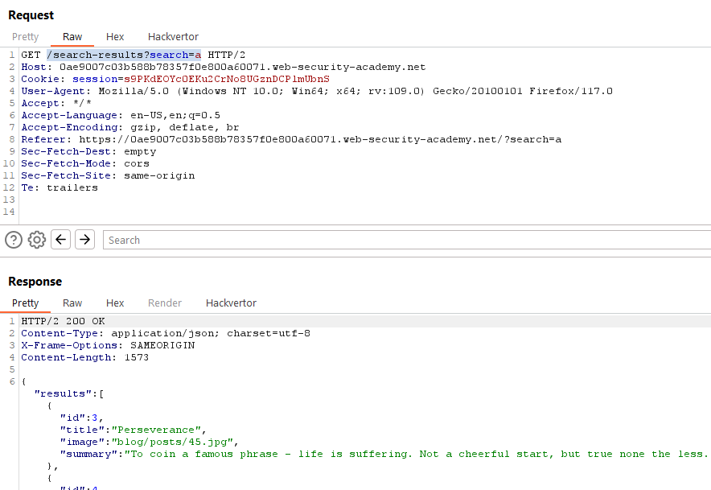

# [Lab 1: Reflected XSS into HTML context with nothing encoded](https://portswigger.net/web-security/cross-site-scripting/reflected/lab-html-context-nothing-encoded)

> - **Mô tả lab:** Lỗ hổng Reflected XSS trong chức năng `Search`.
> 
> - **Mục tiêu:** Thực hiện tấn công gọi chức năng `alert`.

`Search`: khi search gì thì kết quả trả về ngay lập tức giống như đã search → ta nghĩ đến `Reflected XSS`

add script alert

solve the lab

> **Test bẳng Active Scan**

# [Lab 2: Stored XSS into HTML context with nothing encoded](https://portswigger.net/web-security/cross-site-scripting/stored/lab-html-context-nothing-encoded)

> - **Mô tả lab:** Lỗ hổng `Stored XSS` trong chức năng `Comment`
> 
> - **Mục tiêu:** gửi `comment` gọi chức năng `alert` khi bài đăng trên blog được xem.

Khi `View post`: xem blog post, trong này có chức năng mới `Post comment`

nhất định comment sẽ được lưu lại rồi → `Stored XSS`, test ở một paramater bất kỳ

Mỗi khi truy cập post đó ta sẽ luôn thấy thông báo `1` được hiển thị

solve lab luôn

> **Test bẳng New Scan**

# [Lab 3: DOM XSS in `document.write` sink using source `location.search`](https://portswigger.net/web-security/cross-site-scripting/dom-based/lab-document-write-sink)

> - **Mô tả lab:** Lỗi `DOM-based XSS` ở chức năng `Search`. Sử dụng `document.write` để ghi dữ liệu ra trang. Và nó được gọi với dữ liệu từ `location.search` mà có thể kiểm soát bnawgf cách sử dụng URL.
> 
> - **Mục tiêu:** Thực hiện tấn công gọi hàm `alert`.

- `Search`:

khi send request search

xem response, ta thấy có đoạn `script` thực hiện searcg có sử dụng sink `document.write` và source `window.location` (`location.search`)

chú ý query để test

ta nhận query chính là chuỗi tìm kiếm mà ta nhập, chú ý kết thúc thẻ → payload: `'">`

xuất hiện cảnh báo

solve the lab

> **Test bằng Active Scan**

bị DOM-based XSS

# [Lab 4: DOM XSS in `document.write` sink using source `location.search` inside a select element](https://portswigger.net/web-security/cross-site-scripting/dom-based/lab-document-write-sink-inside-select-element)

> - **Mô tả lab:**
> 
> - **Mục tiêu:**

có 2 chức năng

- Home

- `View details`: xem thông tin sản phẩm, chứa chức năng mới `Check stock`

view details 1 sản phẩm bất kỳ

ta thấy xuất hiện đoạn script checkstock using `window.location.search` để tìm tên store và sử dụng `document.write` với thể `select` để chọn ra store

→ payload: "></select>

thêm storeId để check

add alert

xuất hiện cảnh báo

solve the lab

> **Test bằng Active Scan**

# [Lab 5: DOM XSS in `innerHTML` sink using source `location.search`](https://portswigger.net/web-security/cross-site-scripting/dom-based/lab-innerhtml-sink)

> - **Mô tả lab:** chứa lỗ hổng DOM XSS trong chức năng tìm kiếm, nó sử dụng `innerHTML` để thay đổi nội dung HTML của phần tử div, sử dụng dữ liệu từ `location.search`.
> 
> - **Mục tiêu:** Thực hiện tấn công gọi hàm alert.

3 chức năng

1. `Home`
2. `Search`: test

search 1 cái gì đó

ta thấy đoạn script sử dụng sink `innerHTML` lấy chuỗi message nhập vào và sử dụng source `window.location.search` để thực hiện search

thay thế message thành script alert → thử `script`  thì không thấy có phản hổi gì vì nó nằm trong thẻ `span` mà thẻ `span` chỉ là một thẻ chứa văn bản hoặc nội dung phụ thuộc vào nhu cấu và không phải là một phẩn của DOM → payload ``

xuất hiện cảnh báo

solve lab

3. `View post` → khỏi test luôn :v

> **Test bằng Active Scan**

# [Lab 6: DOM XSS in jQuery anchor `href` attribute sink using `location.search` source](https://portswigger.net/web-security/cross-site-scripting/dom-based/lab-jquery-href-attribute-sink)

> - **Mô tả lab:**
> 
> - **Mục tiêu:**

có 3 chức năng

1. `Home`
2. `Submit feedback` → test

khi vào trang ta sẽ thấy đoạn script có sử dụng attr `href` để chuyển trang và `window.location.search`

giờ ta thay đổi `href` coi nó có back ta đến trang khác không

click `back` thôi

kết quả sẽ chuyển → giờ test JavaScript, các trình duyệt có hỗ trợ method `javascript` sử dụng trên URL → href lúc này sẽ là `javascript:alert(1)`

ví dụ trên trình duyệt `Edge`

thử href với `alert(1)` thử xem sao, hiện cảnh báo rồi

test `alert(1)` mà solve luôn rồi

3. `View post` → khỏi test

> **Test bằng Active Scan**

mỗi lần quét 1 kiểu =((((

# [Lab 7: DOM XSS in jQuery selector sink using a hashchange event](https://portswigger.net/web-security/cross-site-scripting/dom-based/lab-jquery-selector-hash-change-event)

> - **Mô tả lab:**
> 
> - **Mục tiêu:**

các chức năng

- `Exploit server`: 

- `Home`

- `View post` → test

tại trang chủ của web ta có thấy đoạn `script` sink selector `blog-list` và source `window.location.hash` cho ` scrollIntoView` để tự động cuộn đến một thành phẩn cụ thể trên trang

`hash` có thể được người dùng kiểm soát → có thể chèn vào sink selecter `$()` → đưa vòa bằng cách bắt đầu bằng ký tự hash `#` → payload: `<iframe width="940" height="940" src="https://vulnerable-website.com#" onload="this.src+=''">`

go to exploit tạo `iframe` độc hại

view exploit coi kết quả, thành công

add `print()`, nên `Store` lại

view exploit xem thử kết quả

ok, thành công, now `Deliver exploit to victim` and solve lab

> **Test bằng Active Scan**

# [Lab 8: DOM XSS in AngularJS expression with angle brackets and double quotes HTML-encoded](https://portswigger.net/web-security/cross-site-scripting/dom-based/lab-angularjs-expression)

> - **Mô tả lab:**
> 
> - **Mục tiêu:**

3 chức năng

1. `Home`
2. `Search`

quan sát response ta thấy `<` đã bị encode

dấu `'` cũng bị encode

3. `View post`

> **Test bằng Active Scan**

# [Lab 9: Reflected DOM XSS](https://portswigger.net/web-security/cross-site-scripting/dom-based/lab-dom-xss-reflected)

> - **Mô tả lab:**
> 
> - **Mục tiêu:**

3 chức năng

1. `Home`
2. `Search`

khi ta search

ta thấy response có trả về y chang ta search → Reflected XSS, ngoài ra nó còn gọi đến `search-result` → DOM-based XSS.

ta xem file xem có gì

sau đó sẽ là kết quả nhận được

ta bắt đầu test thì thấy `"` đã bị lược bỏ do chuỗi của ta đã bị bắ đầu bởi `"` → ta sẽ đóng chuỗi lại bằng `\"` và nên nhớ vẫn còn đoạn thừa ở cuối nên ta sẽ dùng `//` để comment nó lại

solve the lab thôi

3. `View post` → vẫn là khỏi phải test

> **Test bằng Active Scan**

# [Lab 10: Stored DOM XSS](https://portswigger.net/web-security/cross-site-scripting/dom-based/lab-dom-xss-stored)

> - **Mô tả lab:**
> 
> - **Mục tiêu:**

2 chức năng

1. `Home`

2. `View post`, trong đây có chức năng mới `Post comment` → chắc chắn là lưu vào database → Stored XSS

quan sát các Request ta thấy có các request chứa soure `window.location.search`

→ dấu `<` đã bị mã hóa, tuy nhiên khi đối số đầu tiên là một chuỗi, thì nó chỉ replace lần xuất hiện đầu tiên

và 1 vài sink `innerHtml`

→ thêm `<>` bổ sung vòa đầu comment, cặp này sẽ bị encode nhưng các dấu ngoặc tiếp theo sẽ không bị ảnh hưởng

→ payload bypass: `<>`

solve the lab

> **Test bằng Active Scan**
