## [Lab 11: Reflected XSS into HTML context with nothing encoded](https://portswigger.net/web-security/cross-site-scripting/reflected/lab-html-context-nothing-encoded)

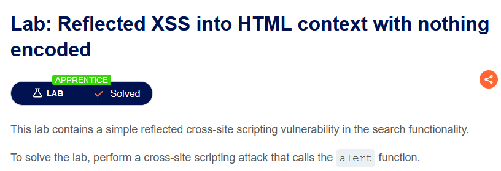

main web

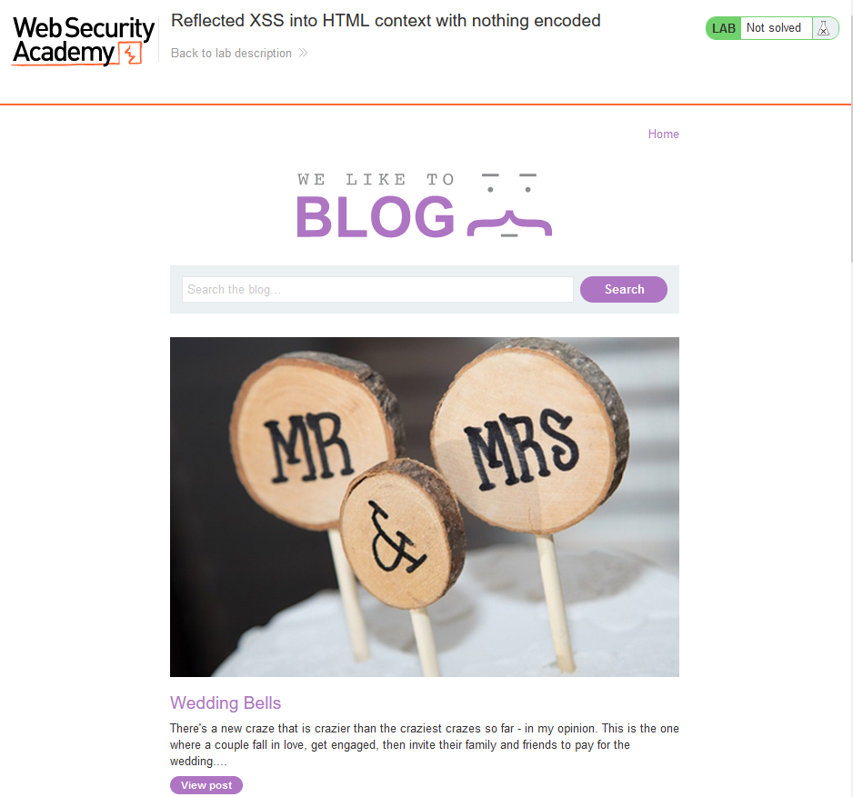

có 3 chức năng

1. `Home`
2. `Search` --> test

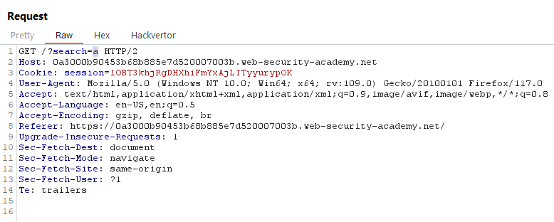

search gì trả về y chang --> Reflected XSS

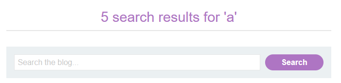

result trong thẻ `h1`

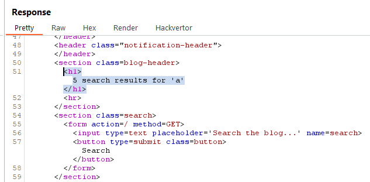

--> add: ``

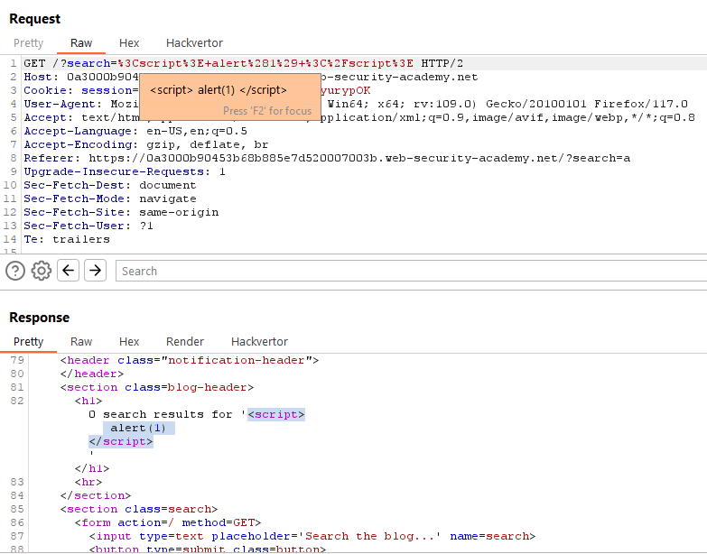

xuất hiện cảnh báo

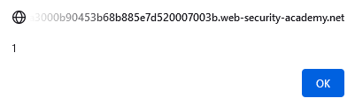

solve the lab

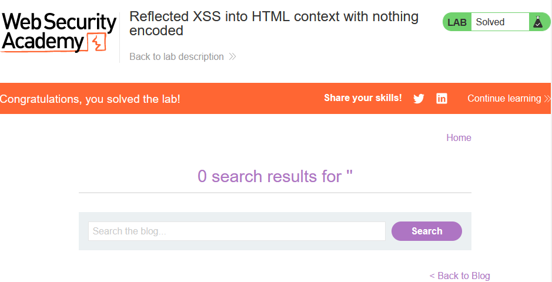

3. `View post`

> **Test bằng Active Scan**

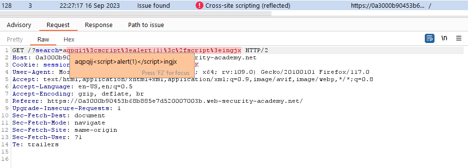

## [Lab 12: Stored XSS into HTML context with nothing encoded](https://portswigger.net/web-security/cross-site-scripting/stored/lab-html-context-nothing-encoded)

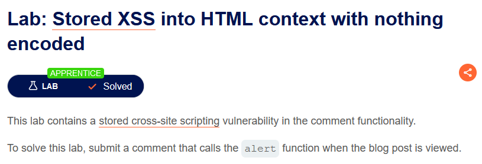

main web

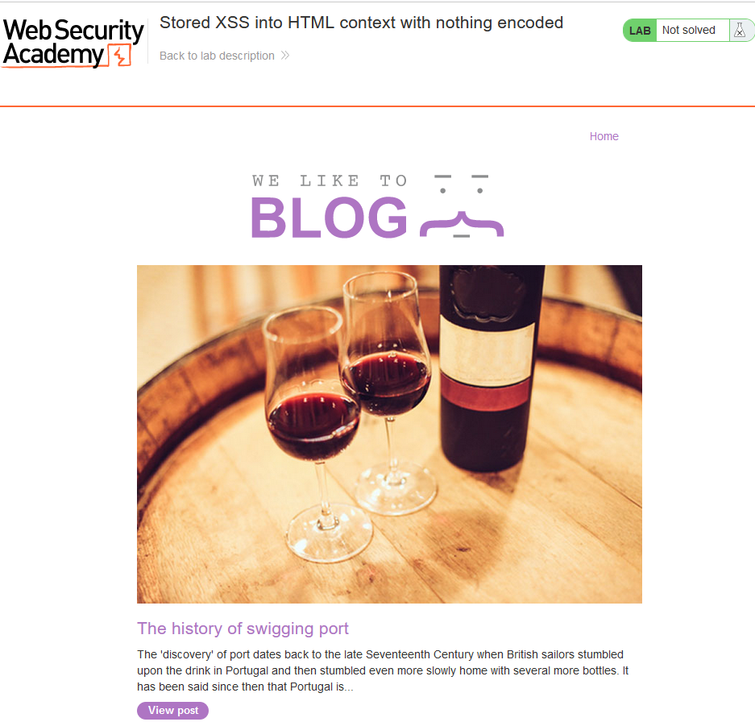

2 chức năng

1. `Home`

2. `View post` --> có thêm chức năng `Post comment`

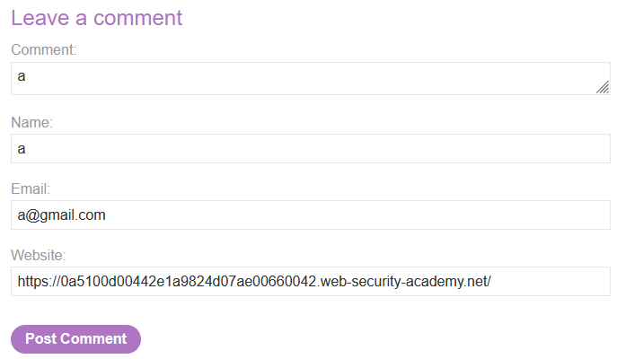

các thông tin của comment đều nằm trong thẻ html

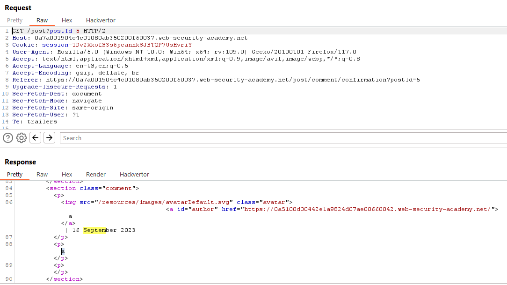

add alert

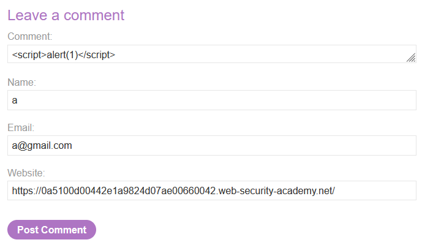

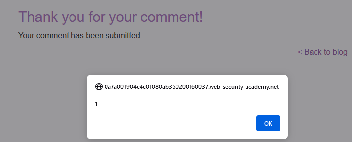

solve the lab

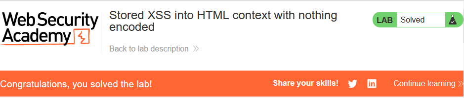

## [Lab 18: Stored XSS into anchor href attribute with double quotes HTML-encoded](https://portswigger.net/web-security/cross-site-scripting/contexts/lab-href-attribute-double-quotes-html-encoded)

- Mô tả lab: Lỗi XSS ở chức năng comment

- Mục tiêu: thực hiện submit comment gọi hàm alert khi click vào author name

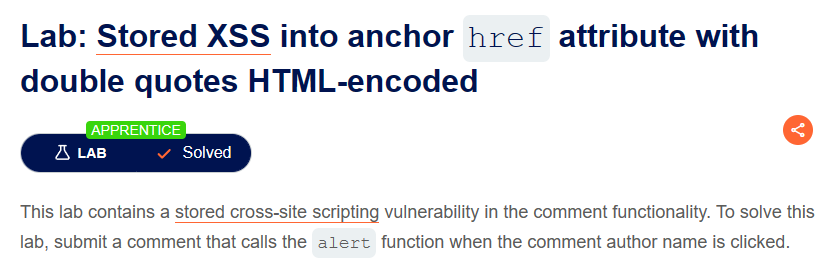

main web

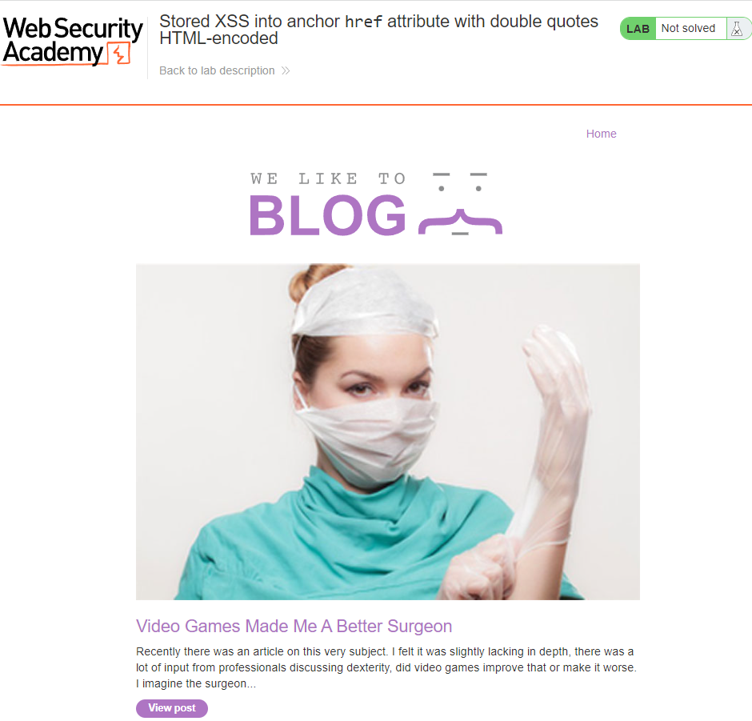

Có 2 chức năng

1. Home

2. View post, khi truy cập ta có thêm Chức năng comment --> liên quan đến database --> Stored XSS

Test thử XSS bằng cách chèn script ``

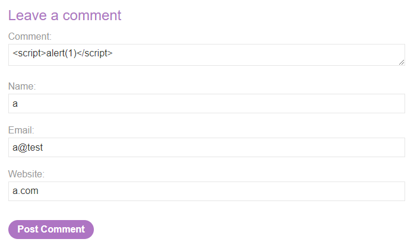

thực hiện không thành công, vì ký tự `<` đã bị encode

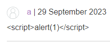

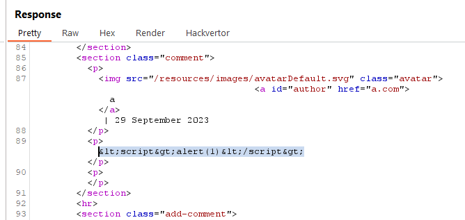

Ta sẽ tìm cách khác để chèn XSS, chú ý rằng khi click vào author name thì nó sẽ chuyển ta đến website mà ta đã comment

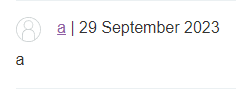

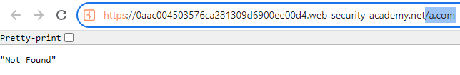

Ta biết đến có protocol có thể thực hiện javascript `javascript:alert(1)`

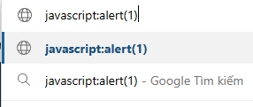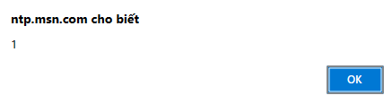

thực hiện comment

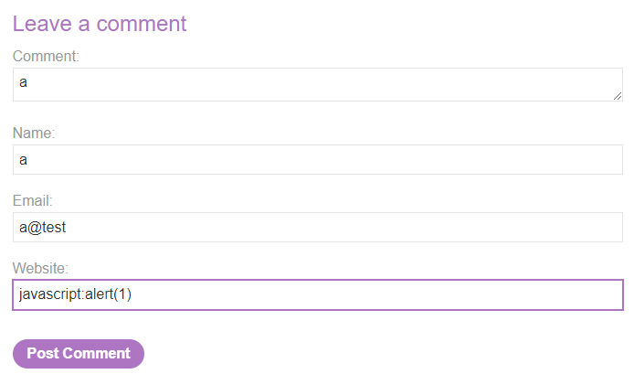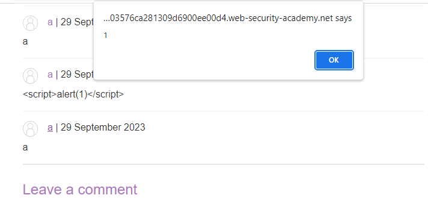

submit và solve lab

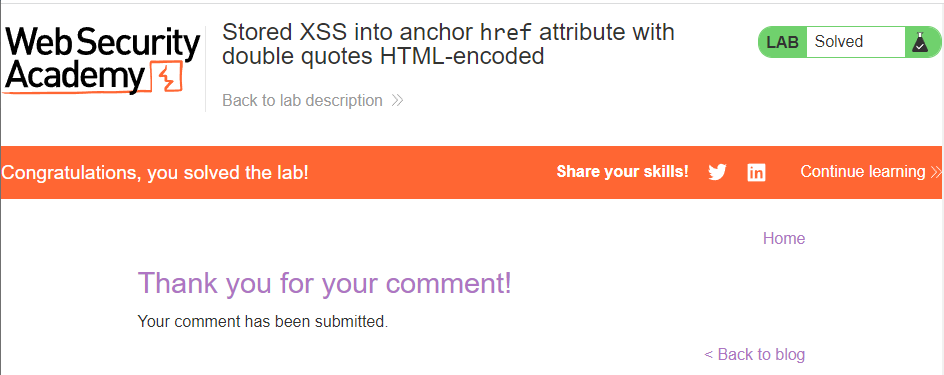