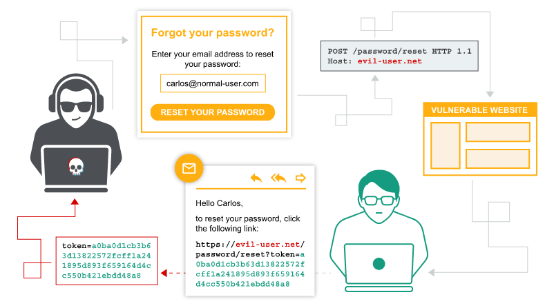

# 1. Định nghĩa

- `Host` header: chỉ định tên miền muốn truy cập

- Host header attack: khai thác trang web dễ bị tấn công xử lý giá trị `Host` header không an toàn. --> Host header injection

# 2. Lý do phát sinh

- do giả định sai rằng header không thể kiểm soát được bởi người dùng.

- bị ghi đè hoặc chèn các header khác.

# [3. Khai thác](./lab/part1.md)

## 3.1. Password reset poisoning (lab 1)

