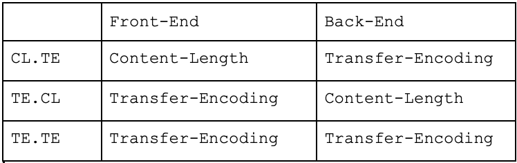
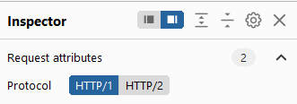

# 1. Định nghĩa

- can thiệp vào cách trang web xử lý HTTP request.

- nghiêm trọng, vượt qua kiểm soát bảo mật và giành quyền truy cập trái phép vào dữ liệu nhạy cảm và trực tiếp xâm phạm người dùng khác.

# 2. Lý do phát sinh

- 2 cách khác nhau chỉ định nơi request kết thúc

    - `Content-Length (CL)`: chỉ rõ length của body tính bằng bytes

    - `Transfer-Encoding (TE)`: body sử dụng chunked encoding (sử dụng 1 hay nhiều khối dữ liệu, kích thước đoạn theo byte (được biểu thị bằng hệ thập lục phân), theo sau là dòng mới, tiếp theo là nội dung đoạn, kết thúc bằng 1 khối size 0)

# [3. Cách thực hiện](lab/part1.md)

> **NOTE**: use HTTP/1.1 with all labs --> change in `Inspector`
> 
>   
>

3.1. CL. TE (lab 1)

3.2. TE. CL (lab 2)
