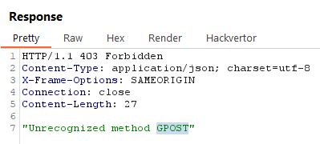

## [Lab 1: HTTP request smuggling, basic CL.TE vulnerability](https://portswigger.net/web-security/request-smuggling/lab-basic-cl-te)

Mô tả lab:
- có FE và BE, FE Không hỗ trợ chunked encoding
- FE từ chối request không sử dụng method GET hoặc POST

Goal:
- chuyển lậu một yêu cầu đến BE, để yêu cầu tiếp theo được xử lý bởi BE dường như sử dụng phương thức `GPOST`.

main web

không sử dụng method khác GET và POST

lấy request POST test

test, send lần 1 chưa thì ra `Invalid blog post ID`

nhưng send lần 2 thì lỗi rồi

solve the lab

> **Test bằng Active Scan**

