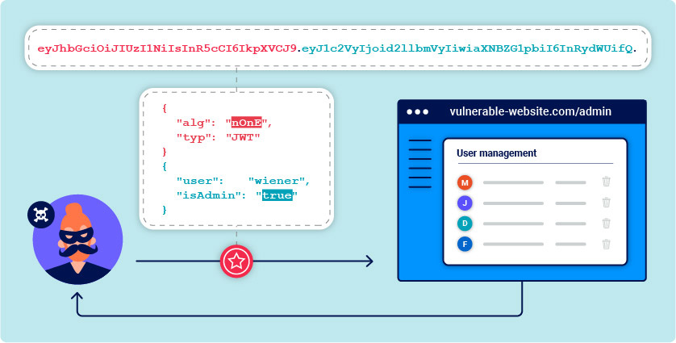

## **_1. Định nghĩa_**

1.1. JWTs

- Mã thông báo web JSON (JWT) là một định dạng được chuẩn hóa để gửi dữ liệu JSON được ký bằng mật mã giữa các hệ thống. Về mặt lý thuyết, chúng có thể chứa bất kỳ loại dữ liệu nào, nhưng được sử dụng phổ biến nhất để gửi thông tin ("khiếu nại") về người dùng như một phần của xác thực, xử lý phiên và cơ chế kiểm soát truy cập.

- Định dạng JWT: 3 phần
  
  - Header: chứa metadata về token
    
  - Payload: chứa thông tin xác thực người dùng
    
    --> chỉ là các đối tượng JSON được mã hóa base64url
    
  - Signature: thường được tạo bằng cách băm header và payload. Cơ chế này cung cấp cách để máy chủ xác minh rằng không có dữ liệu nào trong mã thông báo bị giả mạo kể từ khi nó được phát hành:
    
    - Vì chữ ký được lấy trực tiếp từ phần còn lại của mã thông báo nên việc thay đổi một byte của tiêu đề hoặc tải trọng sẽ dẫn đến chữ ký không khớp.
      
    - Nếu không biết khóa ký bí mật của máy chủ thì sẽ không thể tạo chữ ký chính xác cho tiêu đề hoặc tải trọng nhất định.

1.2. JWT attacks

- Các cuộc tấn công JWT liên quan đến việc người dùng gửi JWT đã sửa đổi đến máy chủ để đạt được mục tiêu độc hại. Thông thường, mục tiêu này là bỏ qua các biện pháp kiểm soát xác thực và truy cập bằng cách mạo danh một người dùng khác đã được xác thực.

- Tác động:
  - thường rất nghiêm trọng: Nếu kẻ tấn công có thể tạo mã thông báo hợp lệ của riêng mình với các giá trị tùy ý, họ có thể nâng cao đặc quyền của riêng mình hoặc mạo danh người dùng khác, chiếm toàn quyền kiểm soát tài khoản của họ.

- Lý do phát sinh:
  - do việc xử lý JWT thiếu sót trong chính ứng dụng. Các thông số kỹ thuật khác nhau liên quan đến JWT được thiết kế tương đối linh hoạt, cho phép các nhà phát triển trang web tự quyết định nhiều chi tiết triển khai. Điều này có thể dẫn đến việc họ vô tình tạo ra các lỗ hổng ngay cả khi sử dụng các thư viện được tăng cường sức chiến đấu.
  
  - Những lỗi triển khai này thường có nghĩa là chữ ký của JWT không được xác minh chính xác. Điều này cho phép kẻ tấn công giả mạo các giá trị được truyền tới ứng dụng thông qua tải trọng của mã thông báo. Ngay cả khi chữ ký được xác minh chắc chắn, liệu nó có thực sự đáng tin cậy hay không phụ thuộc rất nhiều vào khóa bí mật của máy chủ vẫn là bí mật. Nếu khóa này bị rò rỉ theo một cách nào đó hoặc có thể bị đoán hoặc bị ép buộc một cách thô bạo, kẻ tấn công có thể tạo chữ ký hợp lệ cho bất kỳ mã thông báo tùy ý nào, làm tổn hại đến toàn bộ cơ chế.
    
## **_Khai thác_**

[Khai thác xác minh chữ ký JWT thiếu sót](./lab/part1.md)

- Chấp nhận chữ ký tùy tiện (lab 1)
- Chấp nhận mã thông báo không có chữ ký (lab 2)
  - Trong số những thứ khác, tiêu đề JWT chứa tham số alg. Điều này cho máy chủ biết thuật toán nào đã được sử dụng để ký mã thông báo và do đó, thuật toán nào cần sử dụng khi xác minh chữ ký.
  - JWT có thể được ký bằng nhiều thuật toán khác nhau, nhưng cũng có thể không được ký. Trong trường hợp này, tham số `alg` được đặt thành `none`, biểu thị cái gọi là "JWT không bảo mật". Do sự nguy hiểm rõ ràng của việc này, các máy chủ thường từ chối các mã thông báo không có chữ ký. Tuy nhiên, vì loại lọc này phụ thuộc vào phân tích cú pháp chuỗi nên đôi khi bạn có thể bỏ qua các bộ lọc này bằng cách sử dụng các kỹ thuật làm xáo trộn cổ điển, chẳng hạn như viết hoa hỗn hợp và mã hóa không mong muốn.

  > NOTE: Ngay cả khi mã thông báo không được ký, phần tải trọng vẫn phải được kết thúc bằng dấu chấm ở cuối.

- Brute-forcing secret keys
  - sử dụng hashcat (lab 3)
    - Bạn chỉ cần một JWT hợp lệ, có chữ ký từ máy chủ mục tiêu và một danh sách từ gồm những bí mật nổi tiếng. Sau đó, bạn có thể chạy lệnh sau, chuyển JWT và danh sách từ làm đối số: `hashcat -a 0 -m 16500 <jwt> <wordlist>`
    - Hashcat ký tiêu đề và tải trọng từ JWT bằng cách sử dụng từng bí mật trong danh sách từ, sau đó so sánh chữ ký thu được với chữ ký gốc từ máy chủ. Nếu bất kỳ chữ ký nào trùng khớp, hashcat sẽ xuất ra bí mật đã xác định ở định dạng sau, cùng với nhiều chi tiết khác: `<jwt>:<identified-secret>`

- JWT header parameter injections
  - Injecting self-signed JWTs via the `jwk` parameter (lab 4)
    - `jwk` (JSON Web Key) - Cung cấp một đối tượng JSON được nhúng đại diện cho khóa.
    - 
