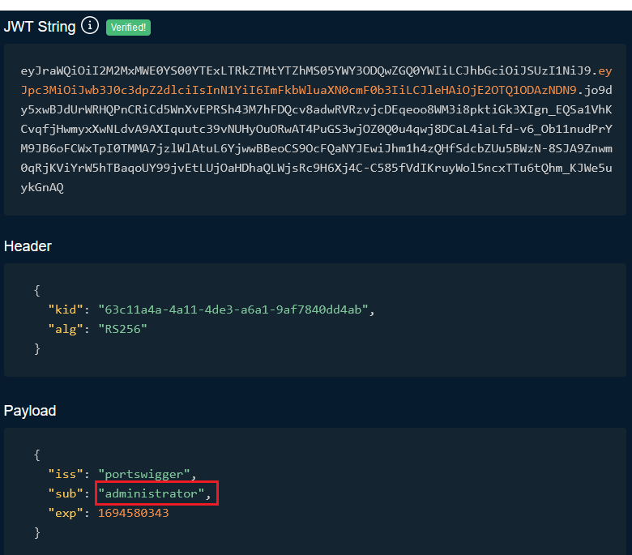
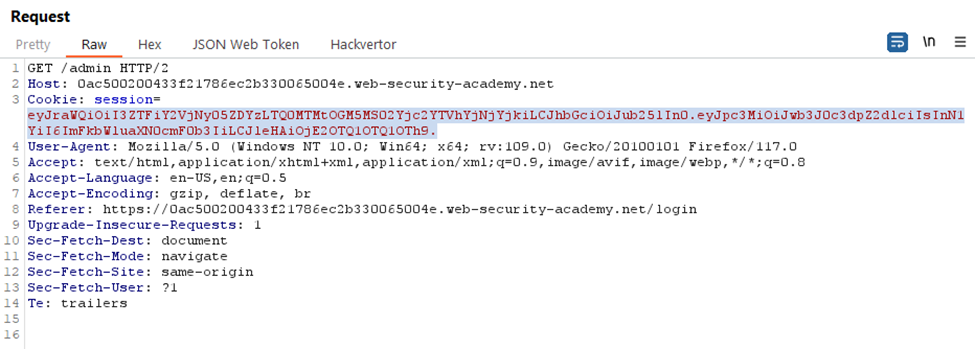
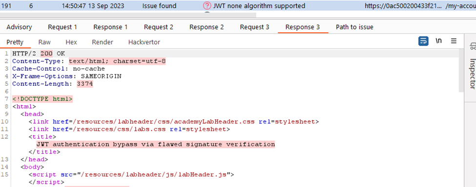
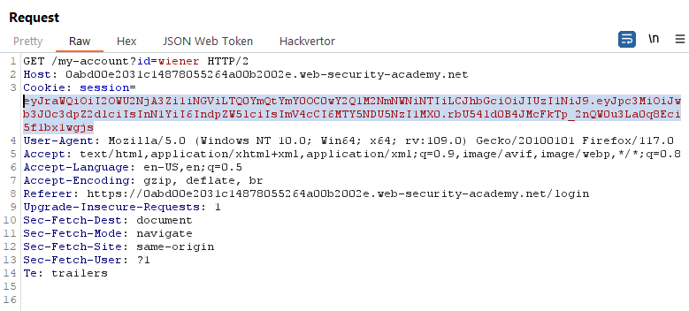
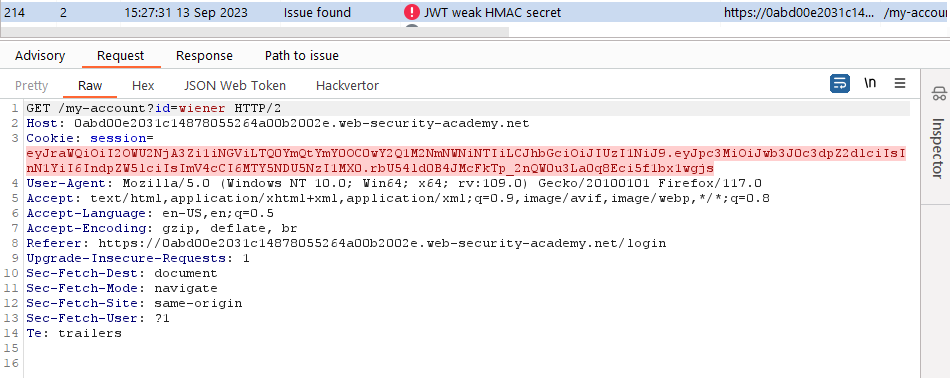
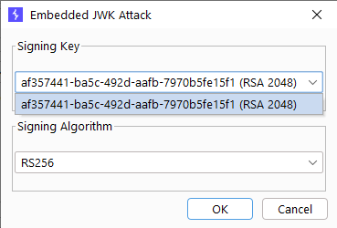
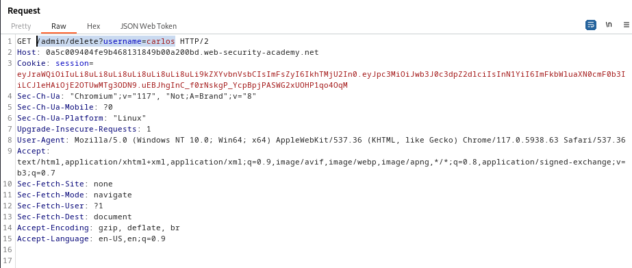

> For all labs, sau khi có jwt token thì thay session trên page rồi delete `carlos` luôn

## [Lab 1: JWT authentication bypass via unverified signature](https://portswigger.net/web-security/jwt/lab-jwt-authentication-bypass-via-unverified-signature)

main web

login with account `wiener:peter`, see request, see JWT 

decode that use `https://irrte.ch/jwt-js-decode/index.html`, see sub: `wiener`

go to `/admin`, vì `wiener` chỉ là user bình thường nên sẽ không vào được `/admin`

see request, có lẽ do có session claim user `wiener`, session trùng với session ở trên nên ta không thể đến `/admin` được

change this to `administrator` and send request

ok, đã bypass thành công, ta dễ dàng thấy href dẫn đến delete account

delete `carlos` account and solve the lab

> **Test bằng tool**

Scan thấy lỗi: lỗi ở key, không hề cần key để sign xác nhận

## [Lab 2: JWT authentication bypass via flawed signature verification](https://portswigger.net/web-security/jwt/lab-jwt-authentication-bypass-via-flawed-signature-verification)

main  web

login

session claim account wiener --> decode, ta phát hiện ngoài xác nhận account `wiener` còn có key và đã sử dụng mã hóa RS256

giữ nó go to `/admin`

hãy tìm cách là `administrator`

trên hình ta set thuật toán mã hóa về none, thì phần key ở cuối bị xóa mất rồi nhưng nó xóa mất cả dấu `.`

solve the lab

> **Test bằng tool: Scan**

- lỗi và payload bypass

## [Lab 3: JWT authentication bypass via weak signing key](https://portswigger.net/web-security/jwt/lab-jwt-authentication-bypass-via-weak-signing-key)

login

decode, ta thấy sử dụng thuật toán mã hóa là hàm băm Hash256

change endpoint `/admin` thì bị block vì user đang là `wiener` chứ không phải `admin`

do sử dụng hàm băm nên ta có thể tìm cách tìm key bằng cách brute-force với list key cho trước là [jwt.secrets.list](https://github.com/wallarm/jwt-secrets/blob/master/jwt.secrets.list)

kết quả sẽ có dạng `jwt_token:key`, tìm thấy `key` là `secret1`

sử dụng key đó để sign và change user to `administrator`

send request

solve the lab

> **Test bằng tool: Scan**

## [Lab 4: JWT authentication bypass via jwk header injection](https://portswigger.net/web-security/jwt/lab-jwt-authentication-bypass-via-jwk-header-injection)

main web

login

decode

`/admin`

`"kid": "af357441-ba5c-492d-aafb-7970b5fe15f1"`

solve the lab

> **Test bằng tool: Scan**

decode, có thêm jwk vào header

## [Lab 5: JWT authentication bypass via jku header injection](https://portswigger.net/web-security/jwt/lab-jwt-authentication-bypass-via-jku-header-injection)

main web

exploit server

login

decode

vậy ta có public key là `{
  "kty": "RSA",
  "kid": "3baf1ea7-3ae1-4ef2-856c-5e4e7964eb45",
  "e": "AQAB",
  "n": "6urRDDfCFSSgOCmVOuqKCsRC4J6lkT8IpZF1WwZppVfuz23QTlQfvKOGM5Krxkb9tXuNgpLN6tItdTP4--LzncTo-mTyL6dBBe-0HS-HGJIwf_3DrvP2vM-aNy58wdHM249RkqHplkac-8xO0yvZoaM3DaqIS1GSIK9PD3JV8HgiGMlDkwl4xFkfIWm1FrWYHD2lJZsoVjYtS3dnQ6APlI15jZCA6w-N92v_8Ka4WH5HTpmPoldJ9DUwe8J6LsinnNpVkqID4OYP8YdFxeVqkjJk-g8wwa64PuJC0Ynx8HF_k23sffkk-Yq0WDGbcRDOopKGaKjDl1WUsHfd7Uvtpw"
}`

bài này lỗi chèn `jku` nên ta sẽ upload 1 `jwk set` độc hại và lấy url để chèn `jku` vào header

Trước hết, send Request trên to Repeater, change endpoint `admin`, đương nhiên sẽ bị block vì user đang là `wiener` và chỉ có thể ok nếu user là `administrator`

tạo 1 RSA key

copy public key vì ta cần lấy nó để chèn vào header

goto exploit server để store key lại và lấy link

change value in Inspector cho nhanh

sign với khóa vừa tạo

send Request với session vừa tạo

đã vào được `/admin`

path delete `carlos`

delete and solve the lab

> **Test bằng tool: Scan**

## [Lab 6: JWT authentication bypass via kid header path traversal](https://portswigger.net/web-security/jwt/lab-jwt-authentication-bypass-via-kid-header-path-traversal)

login with `wiener:peter`

ta thấy có token jwt xác nhận `wiener`

go to `/admin` vẫn với session đó

đương nhiên là bị cấm vì chỉ `administrator` mới có thể vào

decode thì ta phát hiện thuật toán được sử dụng ở đây là `HS256`

do đó ta sẽ tạo một khóa đối xứng để có thể sign, chú ý nên để random secret để tự động cập nhật kích thước khóa, `k` để là base64-encoded của `NULL BYTE` vì khóa thì không thể để rỗng

thay đổi kid và sub

sign

send

