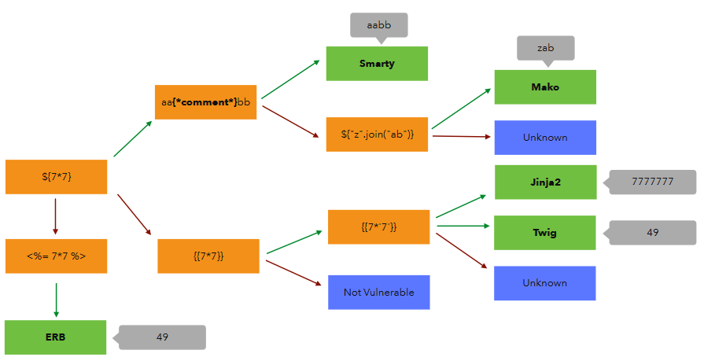

# 1. Định nghĩa

- kẻ tấn công có thể sử dụng các template syntax để chèn 1 payload độc hại vào template mà có thể thực thi ở phía server-side.

# 2. Ảnh hưởng

- có thể lợi dụng để khai thác:

    - `XSS`
    
    - `RCE (Remote Code Execution)`

# 3. Tìm kiếm

***a. Xác định các tham số mà giá trị reflected lại trong response (JSON Response, HTML FE, Email, ...)***

***b. Đưa các payload để xác định Template Engine***

    - Cách thông dụng nhất là sử dụng các toán tử đặc thù riêng của các Template Engine (giống như việc xác định DBMS trong lỗ hổng SQLi)

[***c. Khai thác***](./lab/part1.md)

(lab 1 đến lab 7)

# 4. Phòng chống

- Update Template Engine (Framework, Library)

- Input Sanitization

- Sandboxing

    - Chỉ cho phép thực hiện những lệnh nào trong Whitelist hoặc Blacklist

