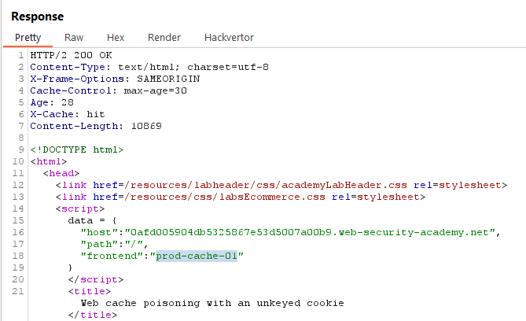
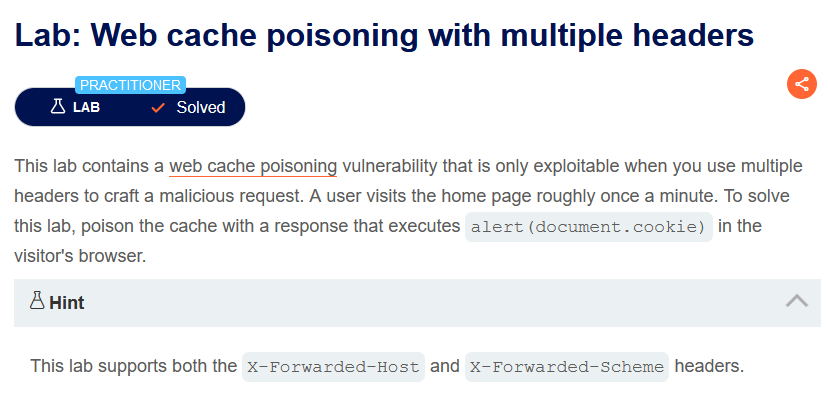
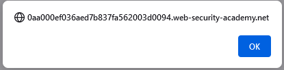
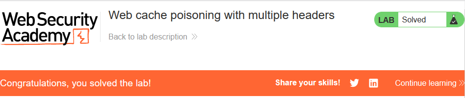

## [Lab 1: Web cache poisoning with an unkeyed header](https://portswigger.net/web-security/web-cache-poisoning/exploiting-design-flaws/lab-web-cache-poisoning-with-an-unkeyed-header)

```
- Mô tả lab: Lỗi Web cache poisoning xử lý đầu vào từ header không khóa theo cách không an toàn.

- Mục tiêu: đầu độc cache bằng thực hiện (document.cookie).

- Hint: sử dụng (X-Forwarded-Host).
```


Khi truy cập lần 1: ta sẽ gặp header `X-Cache: miss`


**X-Cache: miss:** Ngược lại, khi bạn thấy thông báo này, nó cho biết rằng yêu cầu của bạn không có sẵn trong cache của máy chủ. Do đó, máy chủ phải thực hiện các xử lý bổ sung, như truy vấn cơ sở dữ liệu hoặc tạo trang web từ đầu trước khi trả về kết quả cho bạn. Điều này có thể mất thời gian hơn và tăng tải cho máy chủ.

Khi truy cập lần 2, `miss` sẽ đổi thành `hit`


**X-Cache: hit:** Khi bạn thấy thông báo này trong tiêu đề HTTP response từ máy chủ web, nó có nghĩa rằng yêu cầu của bạn đã được tìm thấy trong cache và máy chủ đã trả về nội dung từ cache thay vì tạo yêu cầu mới đối với máy chủ hoặc cơ sở dữ liệu. Điều này thường xảy ra khi trang web đã được truy cập gần đây và nó vẫn còn trong bộ nhớ cache của máy chủ.


xem file tracking.js


thực hiện gọi đến file `tracking.js` mới, tạo file mới trên `Exploit server`


sửa đổi X-Forwarded-Host và send đến khi gặp `X-Cache: hit`


F5 kiểm tra xem có alert thành công không


solve lab


> **Test bằng Insertion Point**


## [Lab 2: Web cache poisoning with an unkeyed cookie](https://portswigger.net/web-security/web-cache-poisoning/exploiting-design-flaws/lab-web-cache-poisoning-with-an-unkeyed-cookie)


```
- Mô tả lab: 

- Mục tiêu:

```




dấu gạch ngang ("-") được sử dụng để bao gồm chuỗi "alert(1)" bên trong chuỗi lớn hơn, mà không cần phải sử dụng dấu escape hoặc đổi loại dấu nháy. Điều này giúp bạn xây dựng một chuỗi chứa JavaScript code nhúng (cross-site scripting, XSS) mà không cần phải trốn thoát các dấu nháy.


solve


> **Chưa test tool ra :)**

## [Lab 3: Web cache poisoning with multiple headers](https://portswigger.net/web-security/web-cache-poisoning/exploiting-design-flaws/lab-web-cache-poisoning-with-multiple-headers)



```
- Mô tả lab:

- Mục tiêu:
```


test thêm `X-Forwarded-Host` thì không thấy có gì,  tuy nhiên khi thêm  `X-Forwarded-Scheme` thì status code thay đổi thành `302`




